Momentum is a **desktop app** that **helps freelancers track time spent on different projects** and **gain insights on how their time is spent**.

It is designed for people that prefer typing, so that frequent tasks can be done faster by typing in commands.

* Table of Contents
{:toc}

--------------------------------------------------------------------------------------------------------------------
## Introduction

Attention all freelancers, because here is an application you have always wanted, but never got to experience!

Us freelancers are always busy managing multiple projects at once. On top of that, we need to be well aware of multiple deadlines, meeting dates with different companies, and sub-tasks under each project… the list is endless, but sadly, our brain capacity is exhaustive.

As freelancers ourselves, we understand. We too have had times where we woke up feeling fresh, before realising (with a shiver down our spine) that we have completely forgotten about a certain project deadline. 

This is why we have developed an application for freelancers, and freelancers only. 

Leave it to Momentum to do the following for you:
* Organisation of projects
    * View projects’  sub-tasks, deadline, description with just a few keystrokes
    * Find any projects and task in Momentum with a single command
    * Sort projects in different orders to your convenience at any time
* Project Management
    * Set reminders to remind you of upcoming deadlines
    * Sort projects by deadline to prioritise tasks 
* Time Management
    * Keep track of how much time you have been spending on each project using our time-tracking tools
    * Gain insights into your time usage with our statistics feature
* Personalisation
    * Personalise Momentum’s settings to fit your preference.

We present you Momentum, the application that will make sure you never lose your momentum in your work ever again.

## About This Document
This user guide provides detailed explanation and walkthroughs on the features and functionalities of Momentum. If you wish to learn how to use Momentum, this guide is for you. Before proceeding on, here are a few things you should take note about this document.

### Notations Used
Throughout this document, you may come across these notations:

* **Clickable Links**: Words or phrases that are blue in colour are links which you can click on that will take you over to the section or page as describe. For example, clicking on [this]() will take you back to the introduction of the user guide.

* **Info Boxes**: These will display additional information that is good for you to know. There are two types of boxes, tip and warning boxes, and they are showed below:

  

  
  :bulb: These are tip boxes. They will provide you with useful tips.

  

  

  
  :warning: These are warning boxes. They will contain information of things that you should be careful of.

  

* **Keyboard Keys**: Words that are wrapped in a box like <kbd>this</kbd> points to a corresponding key on your keyboard.

### Complex Terms
Are we still hyperlinking those terms to the glossary?

### Screenshots
Screenshots of the application in this document shows the application being used in a macOS operating system. However, note that this application can be used on other major operating systems as well.

## Quick Start

1. Ensure you have Java `11` or above installed in your computer.

2. Download the latest `momentum.jar` from [here](https://github.com/AY2021S1-CS2103T-T10-1/tp/releases).

3. Copy the file to the folder you want to use as the _home folder_ for Momentum.

4. Double-click the file to start Momentum. The GUI similar to below should appear in a few seconds.  
   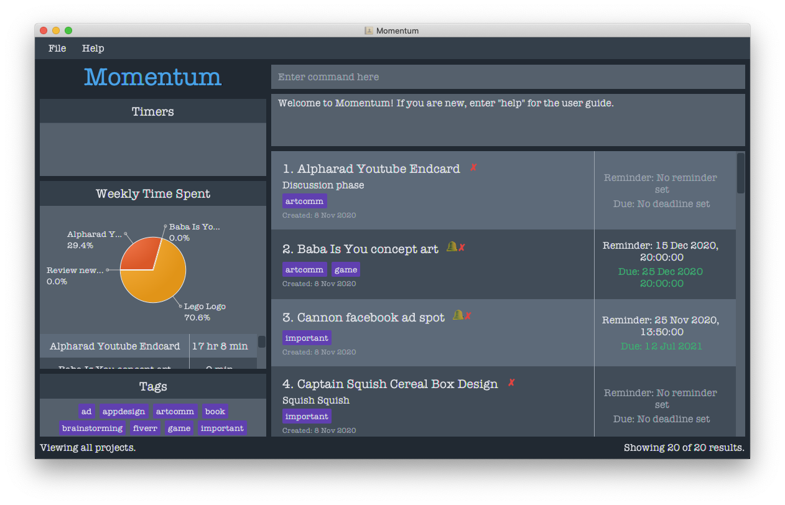

5. Type the command in the command box and press `Enter` to execute it. e.g. typing `help` and pressing `Enter` will open the help window. 

   Some example commands you can try:

   * `view 1` : View the tasks of project at index 1.

   * `home` : Go to home.

   * `add n/Momentum d/CS2103T Team Project` : Add a project named `Momentum` to the Project Book in project view. Add a task named `Momentum` to the project in task view.

   * `edit 3 n/NewMomentum d/newDescription` : Update the 3rd project/task in the current list. The name will be changed to "NewMomentum" and the description will be changed to "NewDescription".

   * `delete 3` : Delete the 3rd project/task shown in the current list.

   * `find n/NewMomentum` : Find a project/task that has `NewMomentum` in its name.

   * `list` : List all projects or tasks based on the current view mode.

   * `sort type/deadline order/asc` : Sort the list of projects/tasks by deadline in ascending order.

   * `start 1` : Start the timer of project/task at index 1.

   * `stop 1` : Stop the timer of project/task at index 1.

   * `exit` : Exit the app.

Refer to the [Features](#features) below for a more comprehensive set of features available in Momentum.

--------------------------------------------------------------------------------------------------------------------

## User Interface Overview

Momentum uses a graphical user interface (GUI) to interact with you. This is where you will give your inputs, and where Momentum will display information to you. This section will give you a walkthrough on the GUI of Momentum.

### User Interface Components

The GUI is made up of multiple components, which is shown in Figure X below.

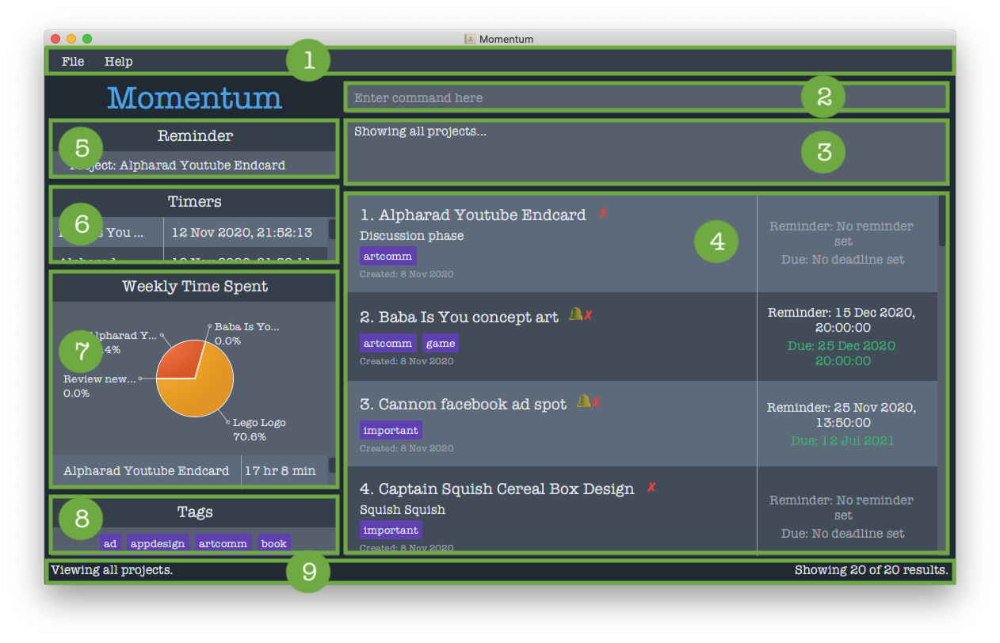
Figure X: GUI of Momentum with different components marked out.

With reference to the numbered labels in Figure X, these are the GUI components and their functions:

1. **Menu Bar**: The menu bar allows you to exit the application, or view this document. To exit the application, click on the `File` button and select "Exit". To view this document, click on the `Help` button and select "User Guide". A window containing the website address to this guide should appear.

2. **Command Box**: This is where you will enter in your commands. After typing your command, hit <kbd>Enter</kbd> to execute them. If you enter an invalid command, your input will turn red.

3. **Result Box**: This is where Momentum will give you feedback on commands that you execute.

4. **Display List**: Displays a list your projects or tasks and all the information pertaining to them.

5. **Reminders Panel**: This is where your reminders will appear. The panel will only show when you have reminders that have not yet been dismissed. (see [Reminders](#reminders))

6. **Active Timers Panel**: Displays a list of all your running timers.
(see [Active Timers Panel](#active-timers-panel))

7. **Statistics Panel**: Displays the statistics of your time usage calculated by Momentum. (see [Statistics](#statistics))

8. **Tags Panel**: Shows a collection of all the tags that are currently present in the display list.

9. **Bottom Bar**: Information about what you are currently viewing on the display list will be shown here. The left side of the bar tells you which project you are viewing, and the right side of the bar tells you how many items are present on the display list, out of the total number of items that you have.  

:bulb: The active timers, statistics and tags panels can be resized so that they can show more information. To do so, click and drag the edges dividing the panels upwards or downwards.

### User Interface Theme

The GUI of Momentum also comes with two themes, Light and Dark. These themes are merely cosmetic and do not affect the application functionality in any way. The themes are shown below:
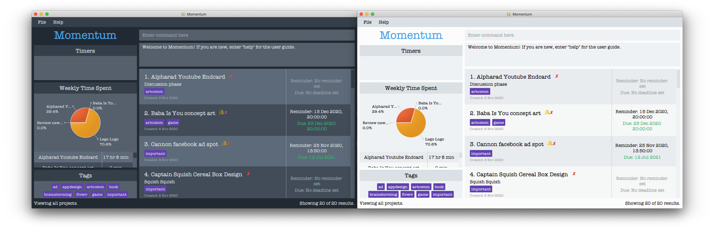
Figure X: Momentum GUI theme

By default, the theme of Momentum is set to Dark. If you want to adjust the theme, you can do so by changing it in the application settings. (see [Settings](#settings))

## Command Format

Below is an explanation of the formatting used to show commands:

* Words in `UPPER_CASE` are the parameters to be supplied by the user.
  e.g. in `add n/NAME`, `NAME` is a parameter which can be used as `add n/Blog Design`.
* Items in square brackets are optional.
  e.g `n/NAME [t/TAG]` can be used as `n/Blog Design t/friend` or as `n/Blog Design`.
* Items with `…`​ after them can be used multiple times including zero times.
  e.g. `[t/TAG]…​` can be used as ` ` (i.e. 0 times), `t/friend`, `t/friend t/family` etc.
* Items with `…` inside square brackets `[t/TAG [MORE_TAGS]...]` can take in multiple space separated arguments
  e.g. `[[t/TAG [MORE_TAGS]...]` can represent `t/friend friend family`.
* Parameters can be in any order.
  e.g. If the command specifies `n/Blog Design dd/2020-11-05`, `dd/2020-11-05 n/Blog Design` is also acceptable.

## Date and Time Terms

This is a guide to the date and time formats used in Momentum.

### Date Terms

Dates should be entered in the order `YYYY-MM-DD`.

Term  | Meaning | Example
----- |-------- | -------
`YYYY`| Year    | `2020`
`MM`  | Month   | `02`
`DD`  | Day     | `09`

**Valid**: `2020-08-02`

**Invalid**: `2-8-20` Wrong number of digits.

**Invalid**: `02-08-20` Wrong order of year, month and date.

**Invalid**: `2nd August 2020` You cannot use text to enter dates.

### Time Terms

Times should be entered in 24 hour format, in the order `HH:MM:SS`.

Term | Meaning | Example
-----|-------- | -------
HH   | Hour    | `16`
MM   | Minute  | `52`
SS   | Second  | `03`

**Valid**: `15:08:02`

**Invalid**: `15:8:2` Wrong number of digits.

**Invalid**: `8:15:2` Wrong order of hour, minute and second.

**Invalid**: `03:08:02PM` Only 24 hour time is accepted.

### Combining Date and Time

You may also have to enter both dates and times together. When entered together, dates and times should be entered in the order `YYYY-MM-DDTHH:MM:SS`. The letter `T` separates the date and time.

**Valid**: `2020-08-02T15:08:02`

**Invalid**: `15:08:02T2020-08-02` Wrong order of date and time.

## `ID` Term

* You need to enter an id which refers to the id number shown in the displayed project/task list.

* You need to enter a **positive integer** such as 1, 2, 3, …​

## Features

### Projects and Tasks

Done by: Farrell Nah Jun Hao

You can add projects into Momentum to be tracked. Each project has the following information:

* Name
* Description
* Completion Status
* Deadline Date
* Deadline Time
* Reminder
* Tag

Apart from the name, all other information is optional.

Each project can also contain several tasks, each with the same information as a project.

When you first open Momentum, you will see all the projects being tracked in Momentum. You can then view the tasks
 for each project separately. seperately using the [view command](#viewing-a-projects-tasks-view)]

**:bulb: Most commands in Momentum will do different things depending on whether you are viewing projects or tasks
.** 
Please refer to each command for these differences.

#### Viewing a Project's Tasks: `view`

Done by: Farrell Nah Jun Hao

View the tasks for a project.

Format: `view ID`

* You can refer to [`ID` Term](#id-term) for more information.

Example: `view 1`

##### Walkthrough of viewing a project's tasks
Suppose you would like to view the tasks belonging to the 2nd project in the list

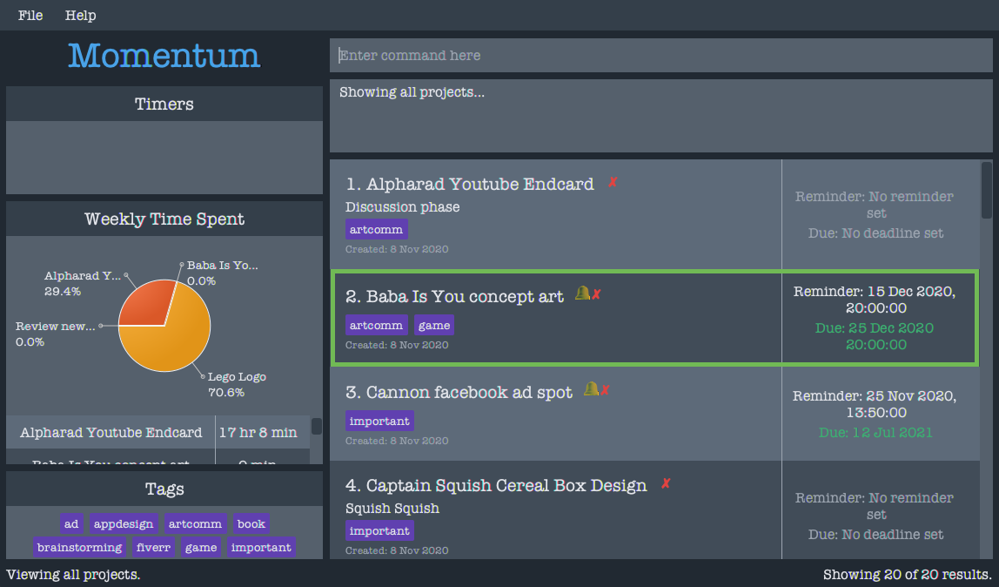

1. Type `view 1` into the command box and press <kbd>Enter</kbd>

    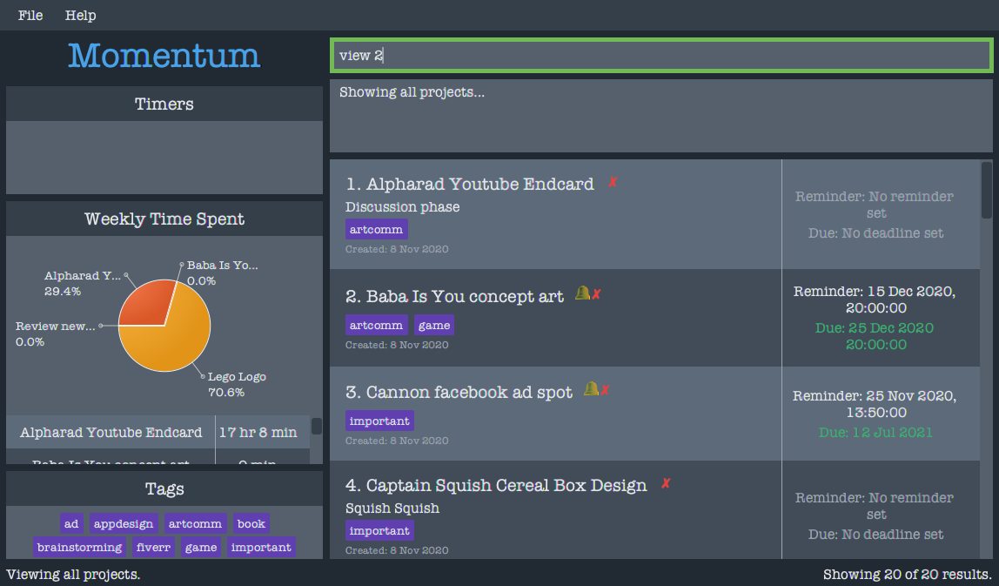

2. The results box will display a message to indicate that you have successfully changed your view. You should see the tasks belonging to the project in the display list.

    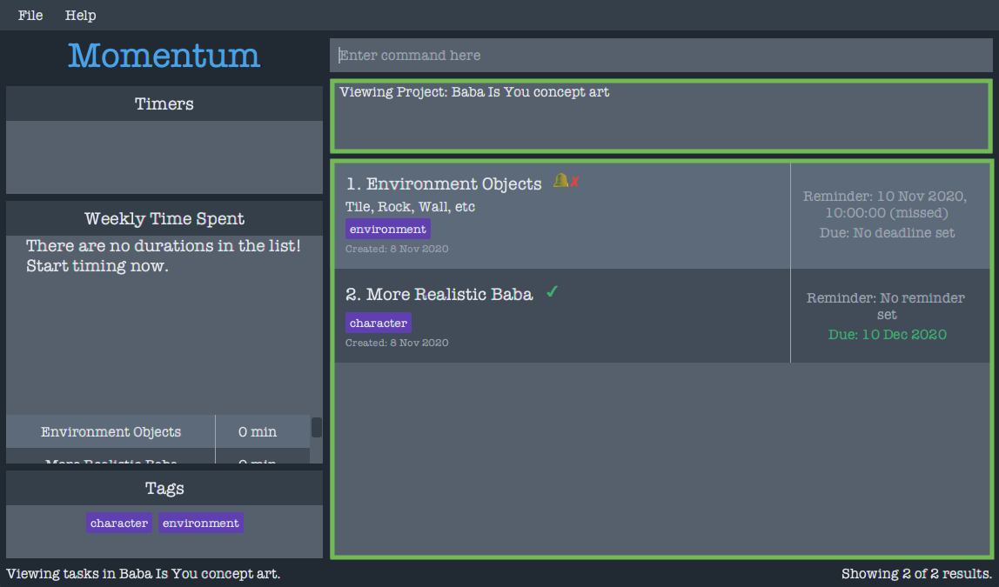
    
#### View Projects: `home`

Done by: Farrell Nah Jun Hao

View all the projects being tracked by Momentum.
This is the default view you will see when Momentum is first opened.

Format: `home`

##### Walkthrough of viewing projects
Suppose you are in task view, and would like to go to project view.

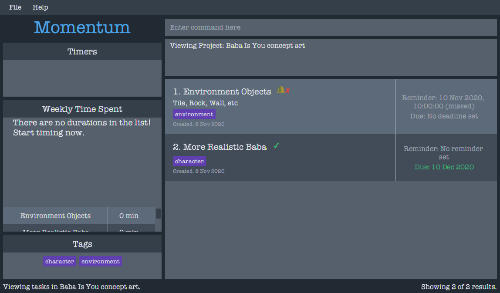

1. Type `home` into the command box and press <kbd>Enter</kbd>

    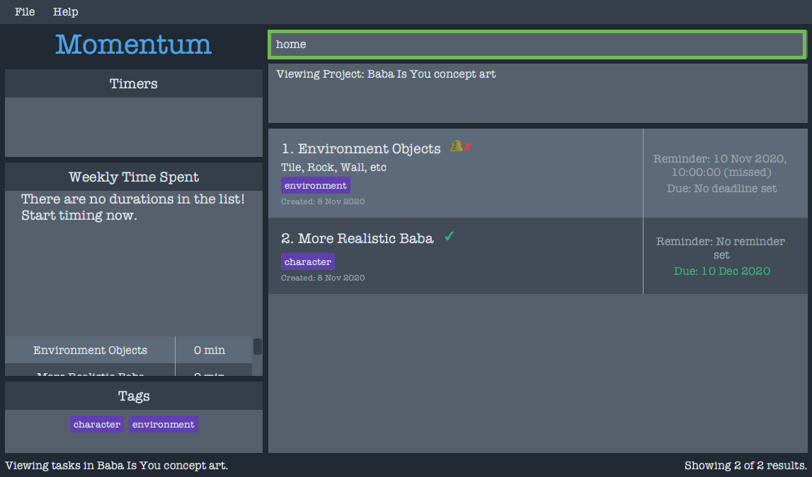

2. The results box will display a message to indicate that you have successfully changed your view. You should see the tasks belonging to the project in the display list.

    

#### Creating a Project/Task: `add`

Done by: Cheong Ying Yi Clara

When Momentum is in [project view](#glossary), you can use the add command to create a new project. When Momentum is in [task view](#glossary), you can use the add command to create a new task for the project that you are viewing.

Format: `add n/NAME [d/DESCRIPTION] [c/] [dd/DEADLINE_DATE [dt/DEADLINE_TIME]] [r/REMINDER_DATE_TIME] [t/TAG]`

* `n/NAME`

  * You can enter alphanumeric characters (a-Z, 0-9) and spaces for names.  

* `[d/DESCRIPTION]`

  * You can enter any character for descriptions.

  

  :bulb: You can enter an empty description.

  

* `[c/]`

  * The project/task added will be incomplete by default.

  * You can add a project/task with completion status complete by entering `c/`.  

* `[dd/DEADLINE_DATE [dt/DEADLINE_TIME]]`

  * Note that `dt/DEADLINE_TIME` is an optional part of the the `dd/`. You cannot enter a deadline with time only.

  * You can enter a deadline with date only.

  * You need to enter the date of the deadline using YYYY-MM-DD format. (refer to [Date Terms](#date-terms) for more information on YYYY, MM and DD)

  * You need to enter the time of the deadline using HH:MM:SS format in 24 hours. (refer to [Time Terms](#time-terms) for more information on HH, MM and SS)

  

  :warning: You cannot enter a date earlier than the creation date of the project/task for deadlines.

  

* `[r/REMINDER_DATE_TIME]`

  * You need to enter both date and time for a reminder.

  * You need to enter date and time of the reminder using YYYY-MM-DDTHH:MM:SS format. (refer to [Date and Time Terms](#Date-and-Time-Terms) for more information on YYYY, MM, DD, HH, MM, and SS)

  

  :bulb: `T` separates the date and time in a reminder.

  

  

  :warning: You cannot enter a date and time earlier than the current date and time for reminders. (refer to [Reminders](#reminders) for more details on reminders)

  

* `[t/TAG]`

  * Similar to names, you can enter alphanumeric characters (a-Z, 0-9) and spaces in tags.

  

  :bulb: You can enter any number of tags, including 0.

  

Example: `add n/Momentum d/CS2103T Team Project dd/2021-12-07 dt/11:01:12 r/2021-12-07T11:01:12 t/impt`

Result: Momentum will create a project/task named "Momentum", with description "CS2103T Team Project", deadline date "2020-10-07" as well as deadline time "11:01:12", reminder "2020-10-07T11:01:12", and tag "impt".

##### Walkthrough of Creating a Project

1. You can type `add n/Momentum d/CS2103T Team Project c/ dd/2021-12-07 dt/11:01:12 r/2021-12-07T11:01:12 t/impt` in the command box, and press the <kbd>Enter</kbd> key to execute it.

2. The result box will display a message to indicate that you executed the command successfully.
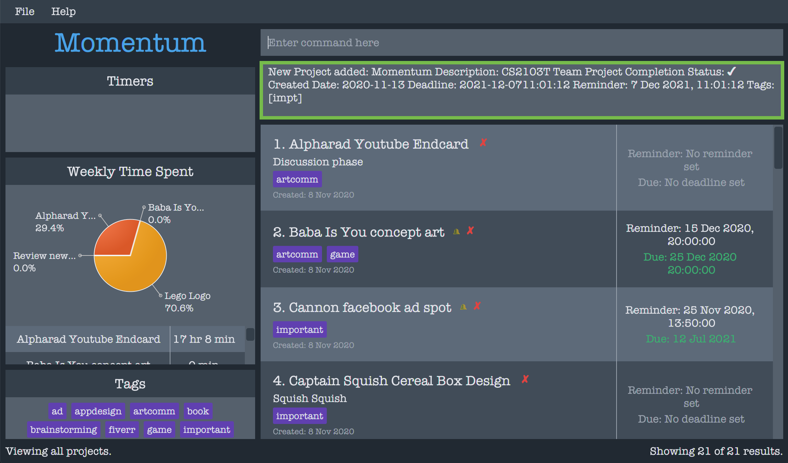

3. You added a project to the project list as shown below.
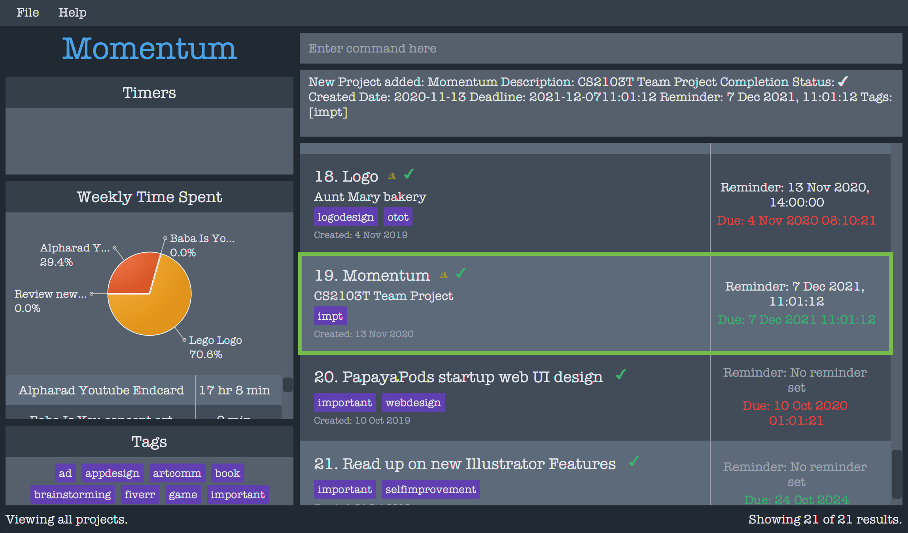

4. On 7 December 2021, at 11:01:12, the reminder panel will show the reminder you added and the reminder of the project will be removed.
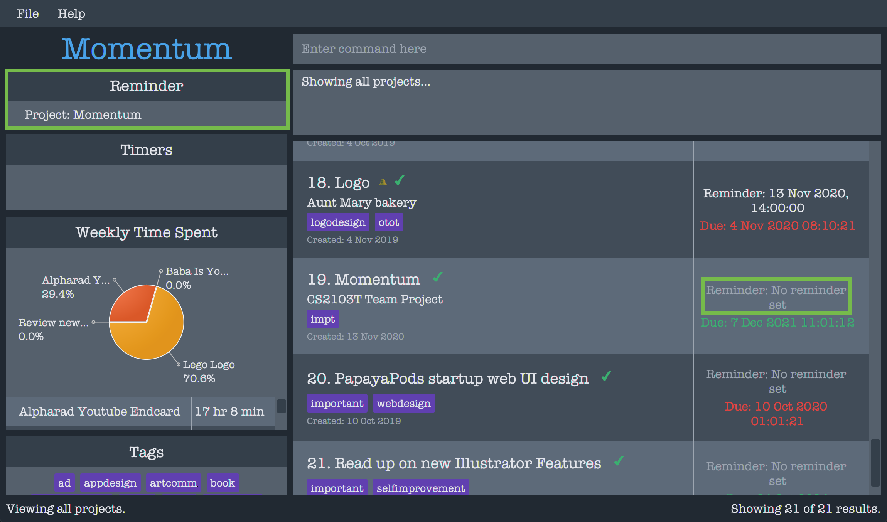

#### Editing a Project/Task: `edit`

Done by Cheong Ying Yi Clara

When Momentum is in [project view](#glossary), you can use the edit command to edit a project. When Momentum is in [task view](#glossary), you can use the edit command to edit a task for the project that you are viewing.

Format: `edit ID [n/NAME] [d/DESCRIPTION] [c/] [dd/DEADLINE_DATE [dt/DEADLINE_TIME]] [r/REMINDER_DATE_TIME] [t/TAG]`

* You need to provide at least one of the optional fields.

* Your input will override the existing values of the project/task edited.

:bulb: You can remove a description, deadline or reminder by typing `d/` or `dd/` or `r/` without specifying anything after it.

* `ID`

  * You can refer to [`ID` Term](#id-term) for more information.  

* `n/NAME`

  * You can enter alphanumeric characters (a-Z, 0-9) and spaces for names.  

* `[d/DESCRIPTION]`

  * You can enter any character for descriptions.  

* `[c/]`

  * You can change the completion status of a project/task by entering `c/`.

  * If the project/task was incomplete, the completion status will change to complete.

* `[dd/DEADLINE_DATE [dt/DEADLINE_TIME]]`

  * Note that `dt/DEADLINE_TIME` is an optional part of the the `dd/`, you cannot enter a deadline with time only.

  * You can enter a deadline with date only.

  * You need to enter the date of the deadline using YYYY-MM-DD format. (refer to [Date Terms](#date-terms) for more information on YYYY, MM and DD)

  * You need to enter the time of the deadline using HH:MM:SS format in 24 hours. (refer to [Time Terms](#time-terms) for more information on HH, MM and SS)

* `[r/REMINDER_DATE_TIME]`

  * You need to enter both date and time for a reminder.

  * You need to enter date and time of the reminder using YYYY-MM-DDTHH:MM:SS format. (refer to [Date and Time Terms](#Date-and-Time-Terms) for more information on YYYY, MM, DD, HH, MM, and SS)

* `[t/TAG]`

  * Similar to names, you can enter alphanumeric characters (a-Z, 0-9) and spaces in tags.

  * Momentum will replace all the existing tags of the project/task with the new tags that you added.

  

  :bulb: You can remove all the project’s tags by typing `t/` without specifying any tags after it.

  

Example: `edit 3 n/NewMomentum d/NewDescription dd/2021-12-07 t/normal`

Result: Momentum will edit the third project/task. The name will be changed to "NewMomentum", the description will be changed to "NewDescription", the deadline will be changed to "2021-12-07", all the tags will be removed and a tag named normal will be added.

##### Walkthrough of Editing a Task

1. In task view, you can type `edit 3 n/NewMomentum d/NewDescription dd/2021-12-07 r/ t/normal` in the command box, and press the <kbd>Enter</kbd> key to execute it.
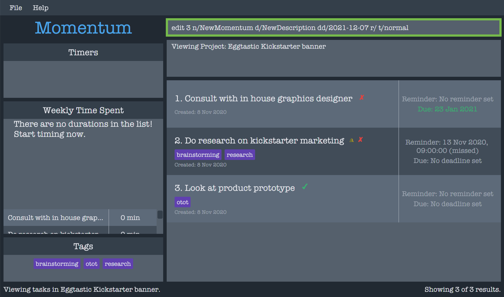

2. The result box will display a message to indicate that you executed the command successfully.
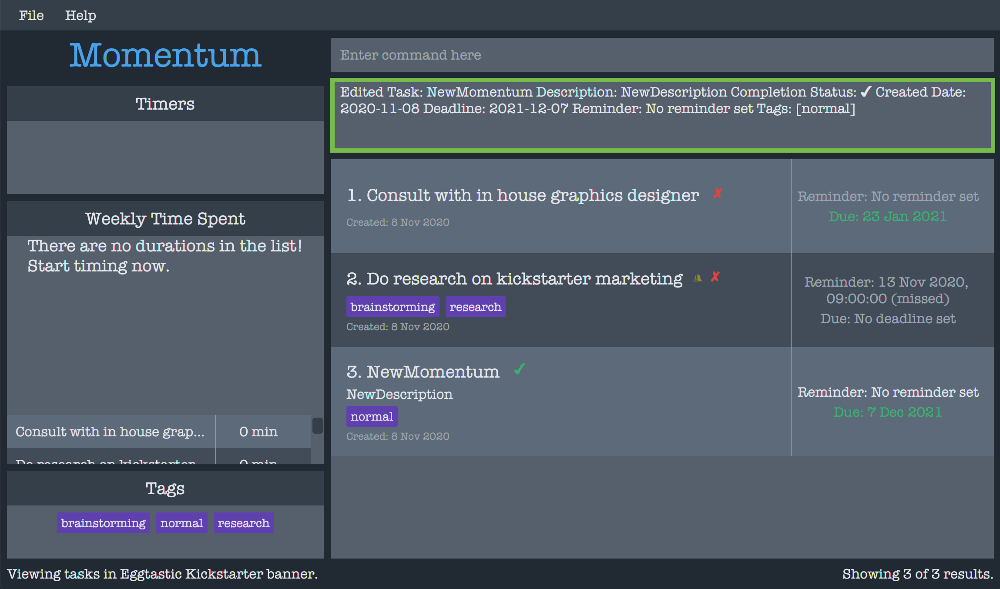

3. You edited a task in the task list as shown below.
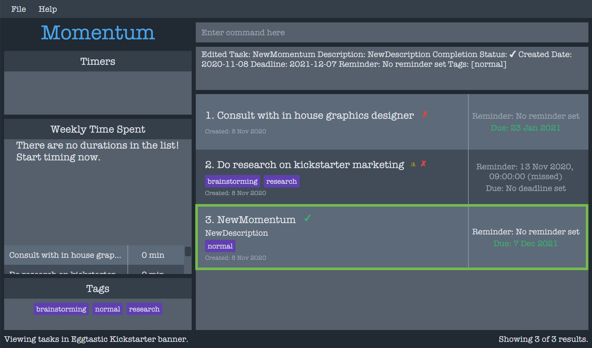

#### Deleting a Project/Task: `delete`

Done by Farrell Nah Jun Hao

Deletes a project or task in the list.

Format: `delete ID`

* Deletes the project or task at the specified `ID`.
* You can refer to [`ID` Term](#id-term) for more information.

Example: `delete 2`

Result: Deletes the second project or task in the list.

##### Walkthrough of deleting a project
Suppose you would like to delete the first project in the list

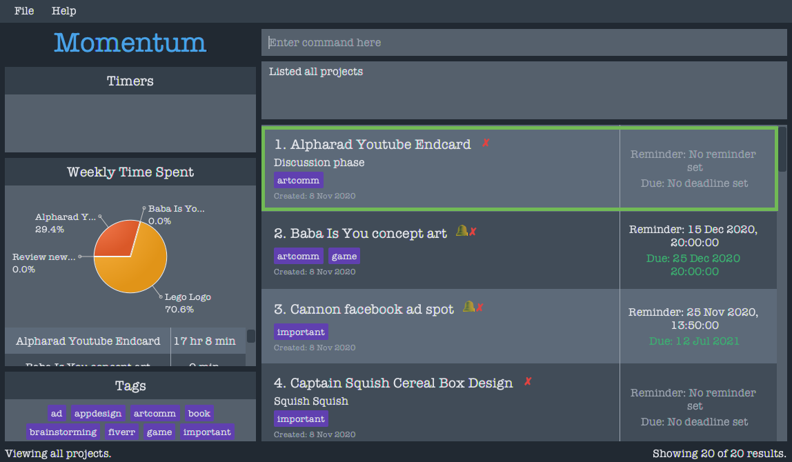

1. Type `delete 1` into the command box and press >kbd>Enter</kbd>

    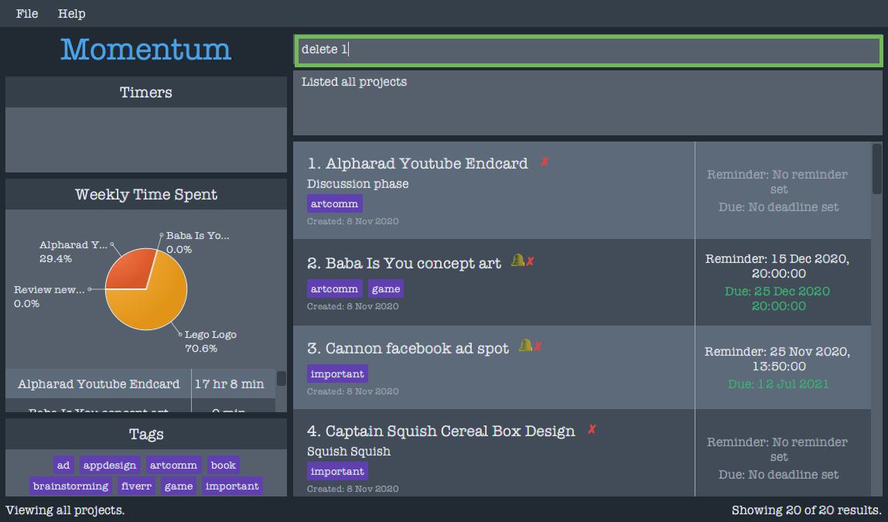
    
2. The results box will display a message to indicate that the project has been successfully deleted. You should no long see the project in the display list.

    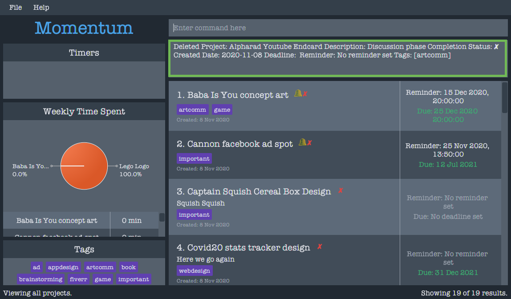

#### View All : `list`

Done by Farrell Nah Jun Hao

When you are viewing projects, this command shows you a list of all projects in Momentum.

When you are viewing a project's tasks, this command shows you a list of all the tasks for the project.

:bulb:
Note that this command is different from the `home` command. When viewing a project's tasks, the `home` command will change the view to show you all the projects being tracked by Momentum. However, the `list` will only show you all the tasks for the project.

Format: `list`

##### Walkthrough of viewing all projects
Suppose you ahd previously executed a [find command]() and would like to see all your projects again.

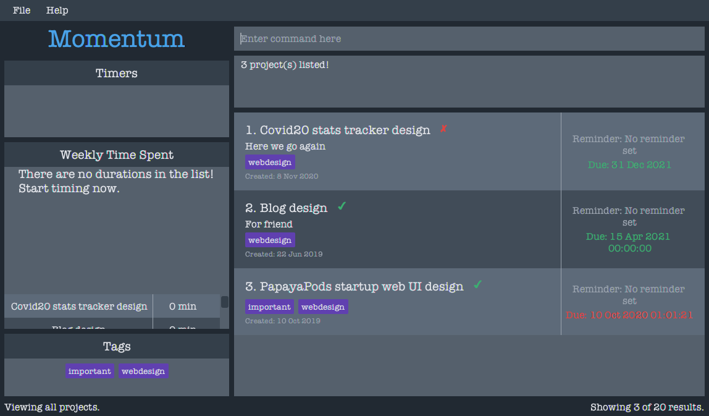

1. Type `list` into the command box and press <kbd>Enter</kbd>

    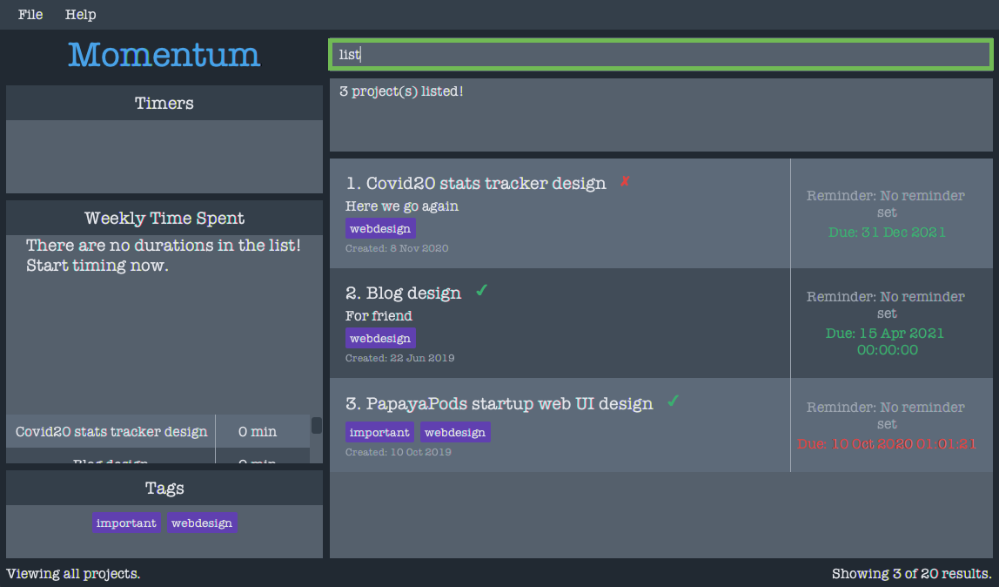
    
2. The results box will display a message to indicate that all your projects are being displayed. You should see that all your projects are being displayed in the display list.

    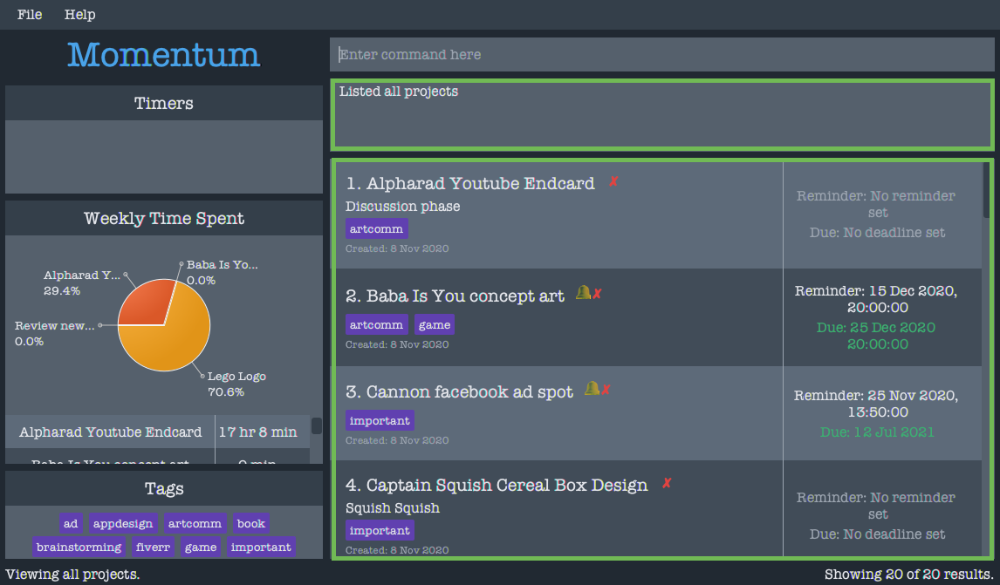

#### Sort Projects : `sort`

Done by Kang Su Min

This command allows you to sort the list of displayed projects or tasks in a particular sort type and order.

Format: `sort [type/SORT_TYPE] [order/SORT_ORDER] [c/]`

* There are 3 sort types.
  * `type/alpha` will sort the list of projects in alphabetical order.
  * `type/deadline` will sort the list of projects according to their deadlines.
  * `type/created` will sort the list of projects according to their date of creation.

* There are 2 sort orders.
  * `order/asc` will sort the list of projects in ascending order.
  * `order/dsc` will sort the list of projects in descending order.

In addition to the above sort types and orders, the list can be sorted by completion status.
* This is the "dominant sort" that will ensure that all incomplete projects/tasks are above complete projects/tasks, before sorting the projects/tasks in the specified sort type and order above.
* The default sort order will sort the projects/tasks by completion status.
* `sort c/` will toggle the default completion status sort.
    * Once the completion status sort is off, the projects/tasks will be sorted in the specified sort type and order without regard for their completion status.

:bulb: 
* When the application first starts, the completion status order is on. This completion status sort status (on/off) is maintained until it is toggled.
* `type/alpha` and `order/asc` will be used as default if both sort type and order are not specified (i.e. command is `sort`)
* For both `sort type/deadline` and `sort type/created`, projects with the same deadline or same created date will be sorted in alphabetical order.
* For `sort type/deadline`, projects/tasks with deadlines will appear at the top of the list sorted in deadline order, while those without deadlines will be pushed to the end of the list sorted in alphabetical order

**Sorting by Default Order**

Format: `sort`

This sorts projects in default ascending alphabetical order.

The following walkthrough shows how you can sort projects in Momentum by the default order.

1. Key in command `sort` in the command window then press <kbd>Enter</kbd>.

2. The result box will display a message to indicate that the command has been executed successfully:

3. All projects are ordered in default ascending alphabetical order with incomplete tasks showing up at the top of the list (Completion status sort is on).
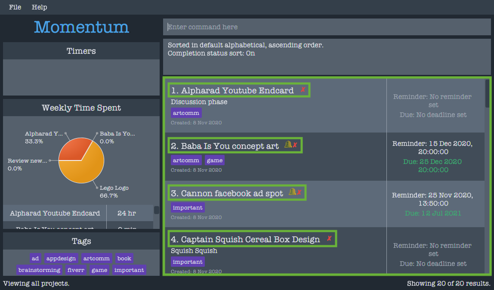

##### Sorting With Completion Status Toggle

Format: `sort c/`

This toggles the completion status order i.e. if the completion status order is "on", the completion status order is turned "off", vice versa.

The following walkthrough shows how you can toggle the completion status order in Momentum.

1. Key in command `sort c/` in the command window then press <kbd>Enter</kbd>.
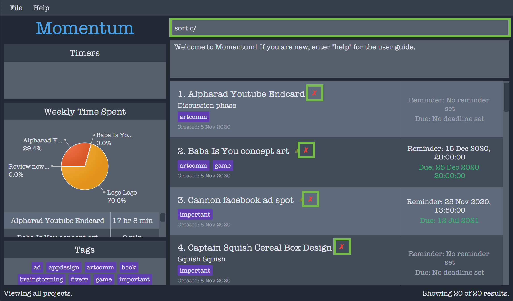
Note that currently all projects at the top of the list are incomplete tasks.
2. The result box will display a message to indicate that the command has been executed successfully:
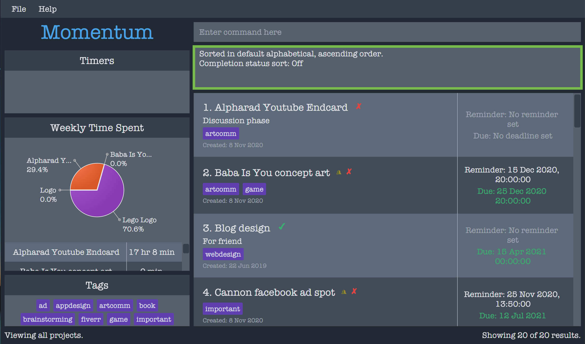
3. All projects are ordered in default ascending alphabetical order without regard for their completion status.
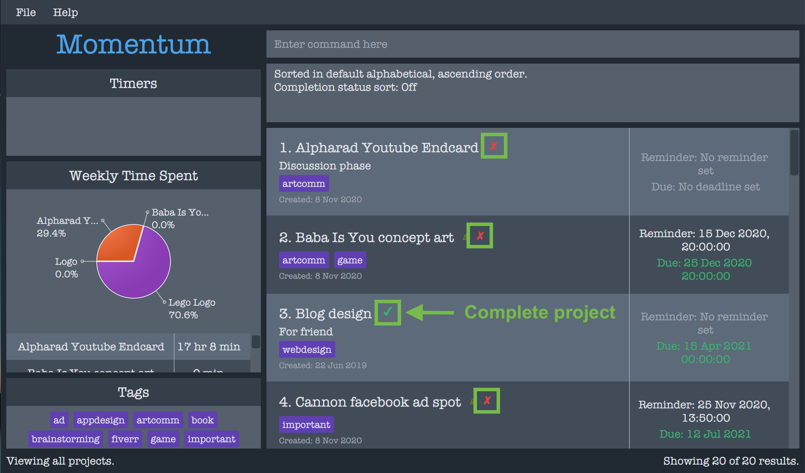

##### Sorting with Only Type Specified

`order/asc` is assumed if the `order` is not specified.
Hence, this sorts projects by the specified sort type, in ascending order.

Format: `sort type/SORT_TYPE`

Example: `sort type/deadline`

The following walkthrough shows how you can sort projects in Momentum by specifying only the sort type.

1. Key in command `sort type/deadline` in the command window then press <kbd>Enter</kbd>.
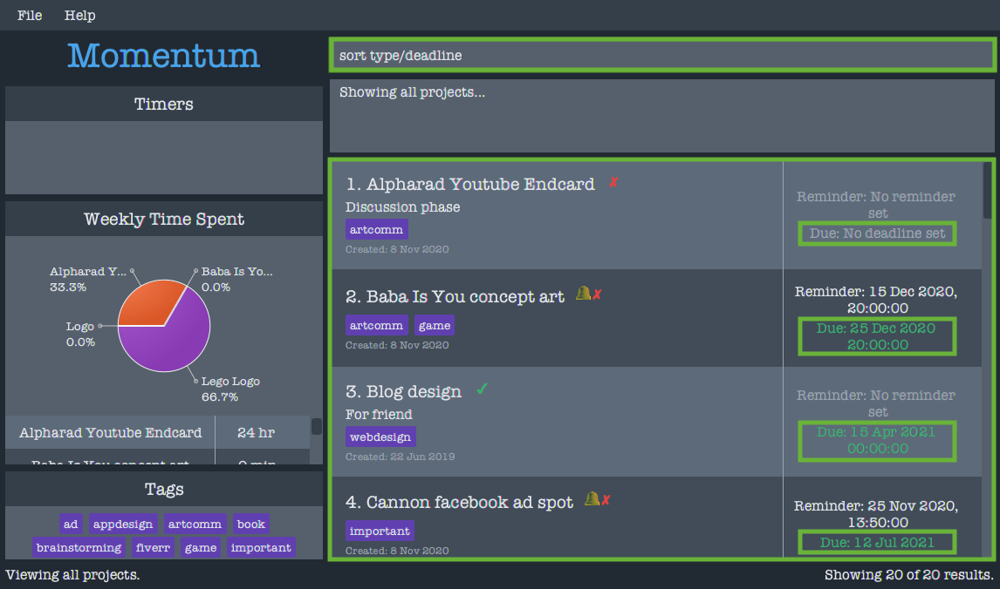
Note that the projects are not sorted in asceding deadline order.
2. The result box will display a message to indicate that the command has been executed successfully:
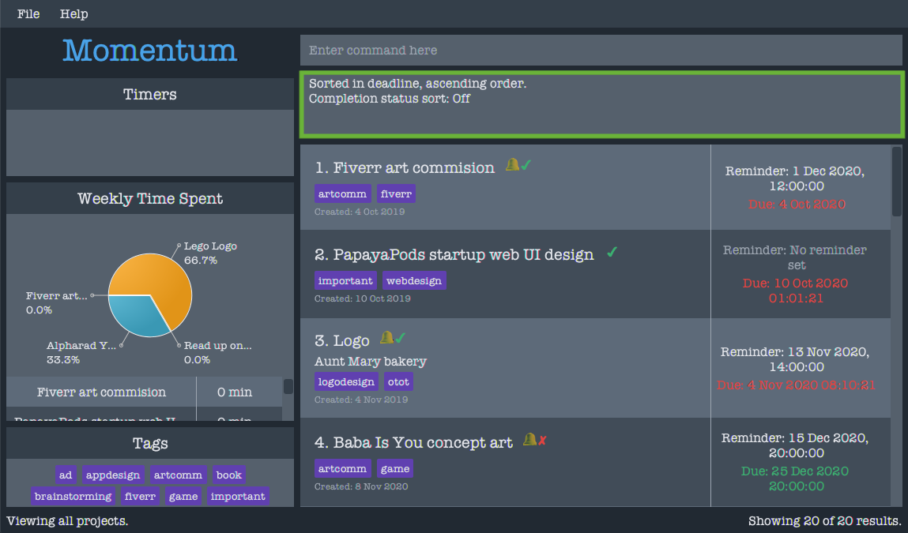
3. All projects are ordered in ascending deadline order.
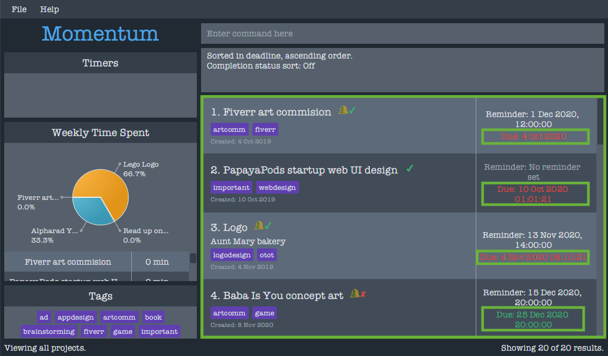

##### Sorting With Only Order Specified

The current sort type is assumed if the `type` is not specified.
If there is no existing project order (when the application restarts), order will be alphabetical by default.

Format: `sort order/SORT_ORDER`

Example: `sort order/dsc`

The following walkthrough shows how you can sort projects in Momentum by specifying only the sort order.

1. Key in command `sort order/dsc` in the command window then press <kbd>Enter</kbd>.
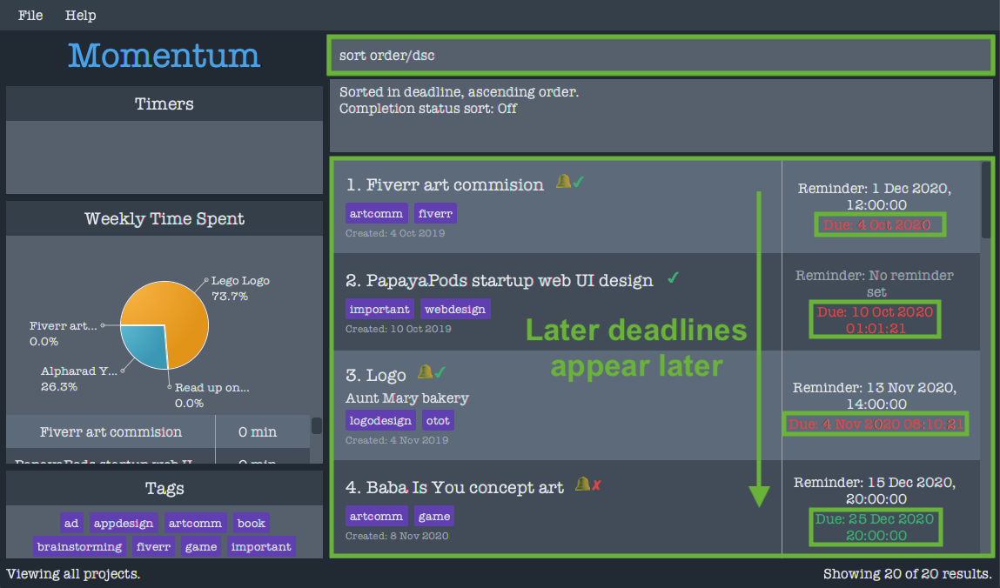
Note that currently the projects are sorted in ascending deadline order.
2. The result box will display a message to indicate that the command has been executed successfully:
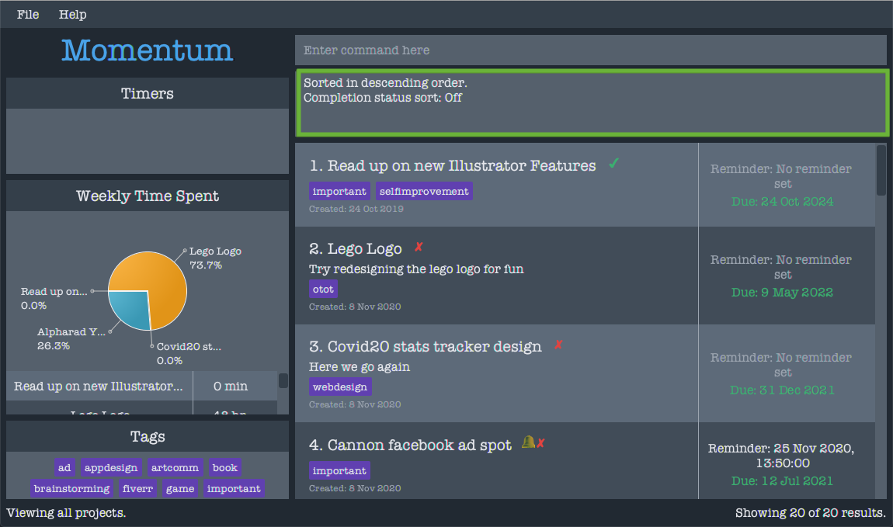
3. All projects are ordered in descending deadline order.
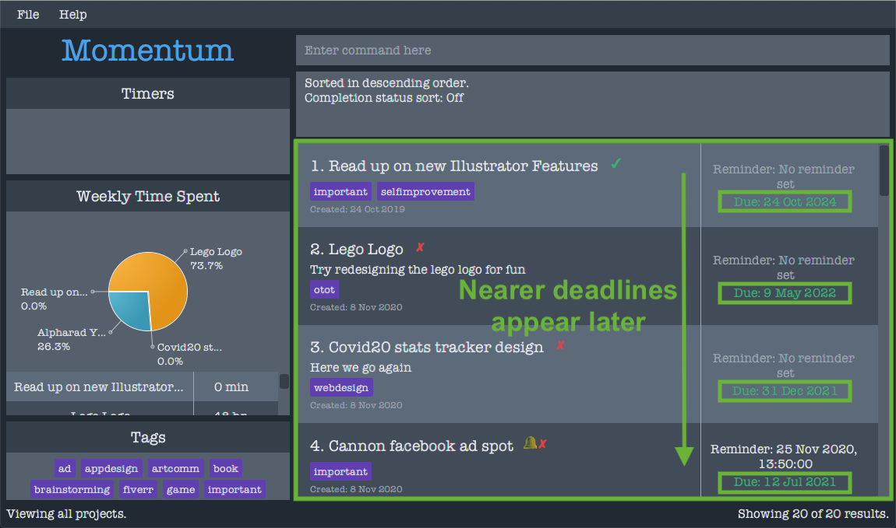

##### Sorting With Both Type and Order Specified

This sorts projects in the specified type and order.

Example: `sort type/created order/dsc`

The following walkthrough shows how you can sort projects in Momentum by specifying both sort type and order.

1. Key in command `sort type/created order/dsc` in the command window then press <kbd>Enter</kbd>.
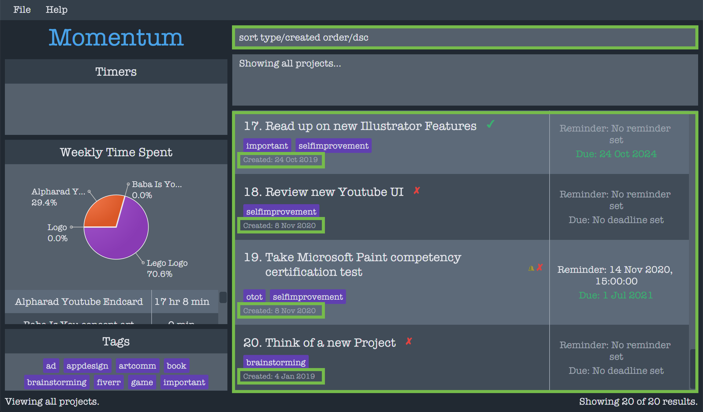
Note that the projects are not sorted by descending created date order.
2. The result box will display a message to indicate that the command has been executed successfully:
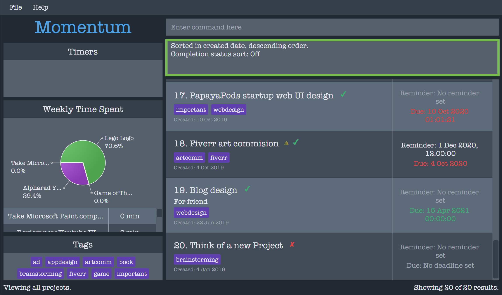
3. All projects are ordered in descending created date order.
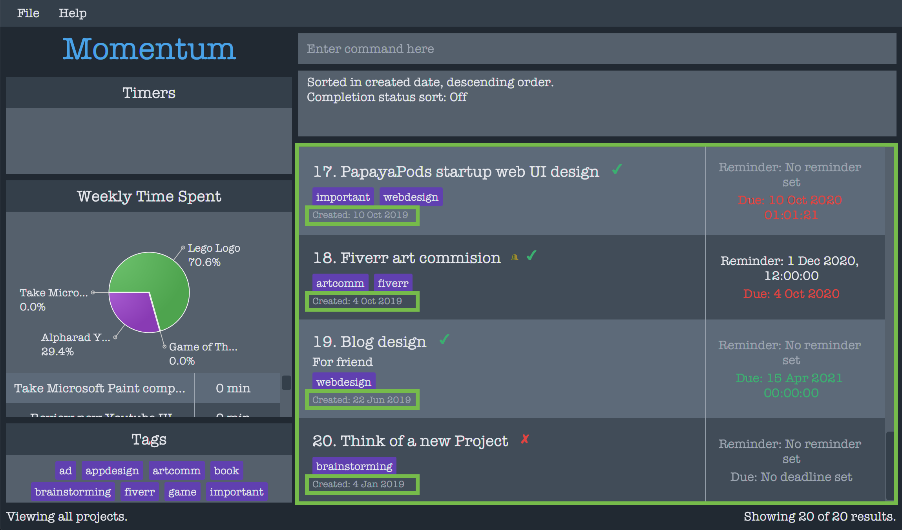
Note that for projects with the same created date, they are sorted in descending alphabetical order.

#### Filtering Projects: `find`

Done by Balasubramaniam Praveen

Momentum allows you to make detailed searches for projects or tasks based on a combination of their name, description, tags and completion status. This is done using the find command.

Format: `find [match/FILTER_TYPE] [n/NAME [MORE_NAMES]...] [d/DESCRIPTION [MORE_DESCRIPTIONS]...] [t/TAG [MORE_TAGS]...] [c/COMPLETION_STATUS]`

Let us now take a look at how to make simple searches using the find command. Advanced searches that utilize the match parameter will be discussed later. 

:bulb: **Tip:**
You can only search for projects in the project view and tasks in the tasks view

:bulb: **Tip:**
Search parameters are not case sensitive.

:bulb: **Tip:**
The projects/tasks in Momentum will no longer be filtered after the `Add`, `View` or `Home` Commands are used.
They will continue to be filtered after the `Edit` and `Delete` Commands are used.

##### Searching by Name

* The `n/` command checks whether a project has a certain name. There can be multiple names added to this command. For example, `n/car window` will check for the projects that contain `car` or `window` in their names.
* Searching by name only requires a partial match. This means that a project with the name `carpet` and `car` can potentially be the result of searching for the term `car`.

The following walkthrough shows how you can use the find command to search for projects with `ad` in their names.

1. Key in the command `find n/ad` in the command window.
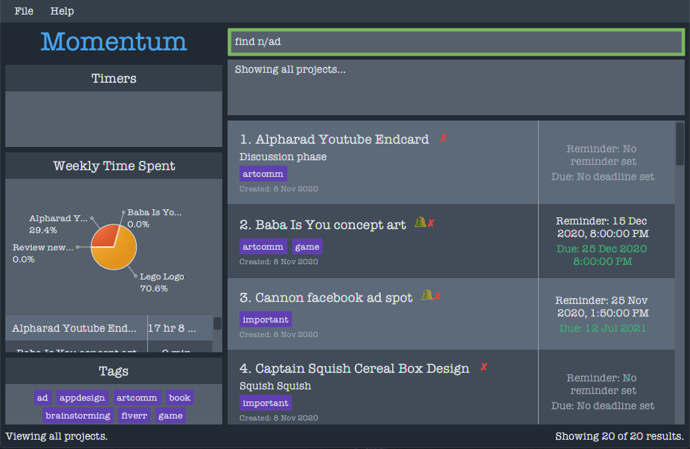
2. The result box will display a message to indicate that the command has been executed successfully:
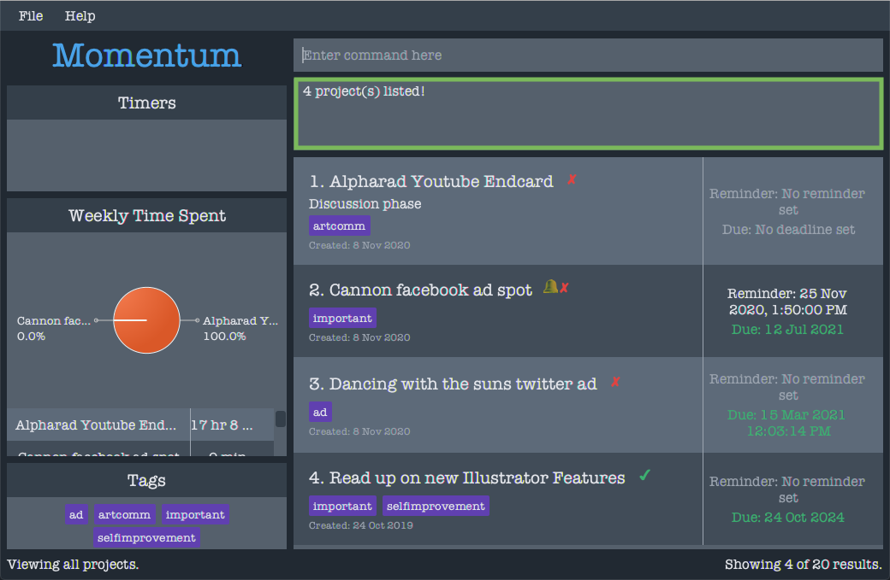
3. All projects that contain `ad` in their name will be shown.
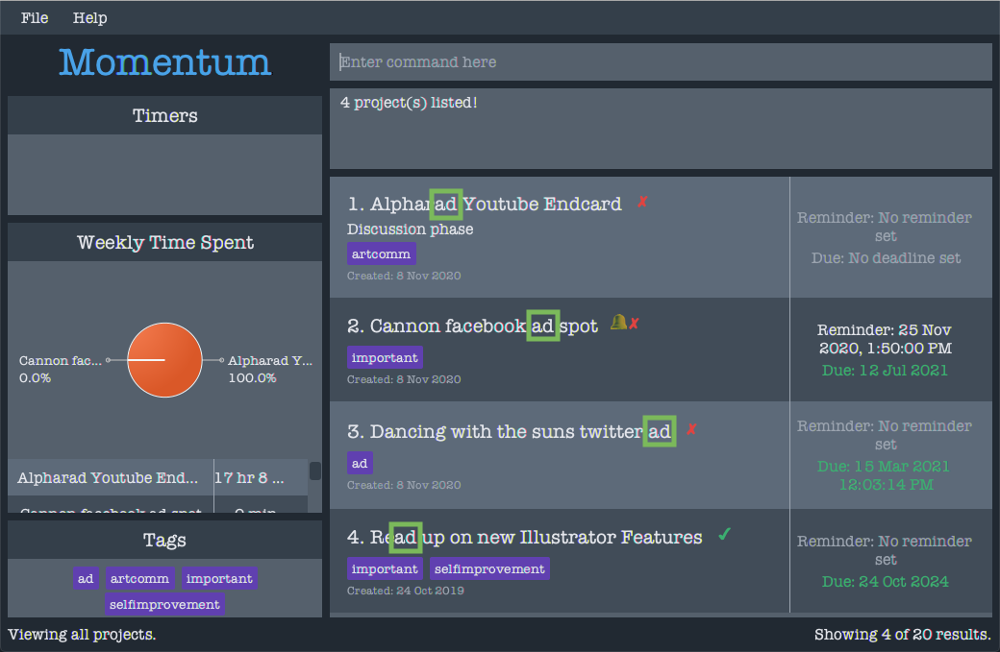

##### Searching by Description

* The `d/` command checks whether a project has a certain description. There can be multiple descriptions added to this command. For example, `d/sunday october` will check for the projects that contain `sunday` or `october` in their description.
* Searching by description only requires a partial match, similar to searching by name.

The following walkthrough shows how you can use the find command to search for projects with `discussion` in their description.

1. Key in the command `find d/discussion` in the command window.

2. The result box will display a message to indicate that the command has been executed successfully:

3. All projects that contain `discussion` in their description will be shown.
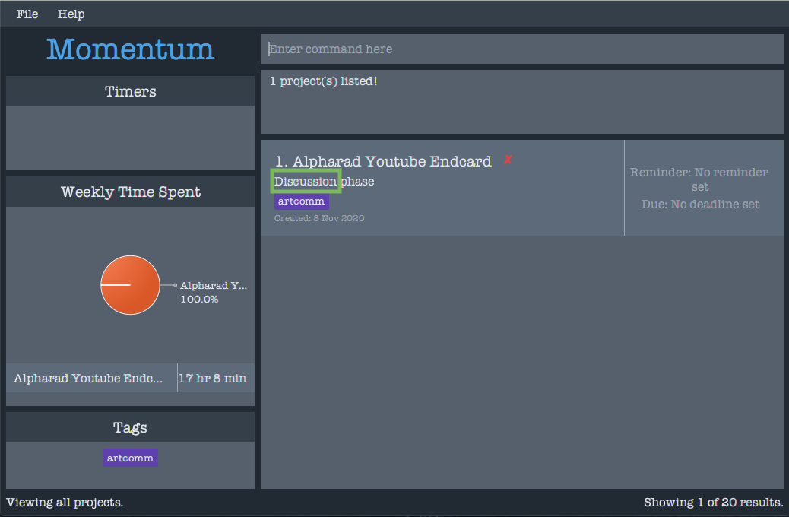

##### Searching by Tag

* The `t/` command checks whether a project has a certain tag. There can be multiple tags added to this command. For example, `t/freelance errands` will check for the projects that contain the tags `freelance` or `errands`.
* Searching by tags will require a full word match unlike searching by name or description. This means that searching for the tag `free` will not find a project with the tag `freelance`.

:bulb: **Tip:**
Searches for tags require a full match whilst partial matches are sufficient for searches by name and description.

The following walkthrough shows how you can use the find command to search for projects with the tag `webdesign`.

1. Key in the command `find t/webdesign` in the command window.
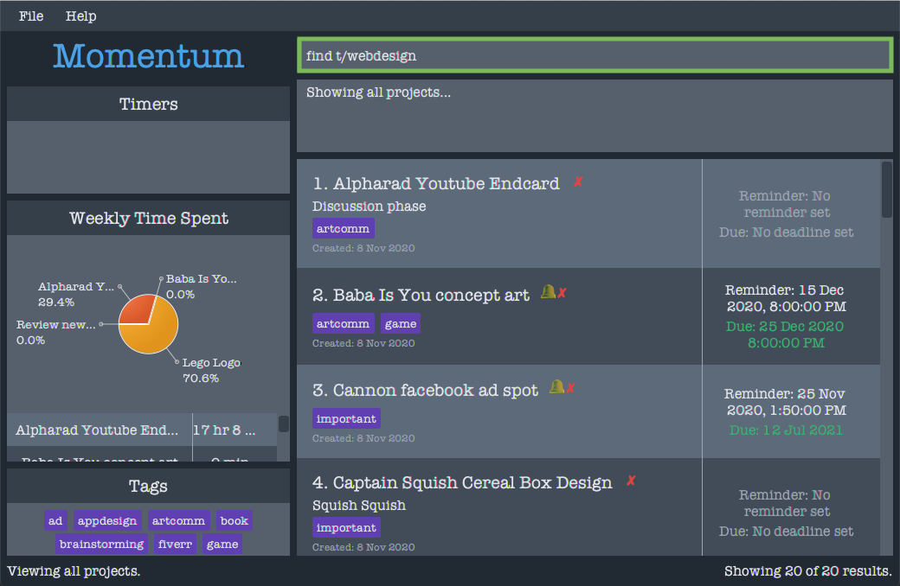
2. The result box will display a message to indicate that the command has been executed successfully:
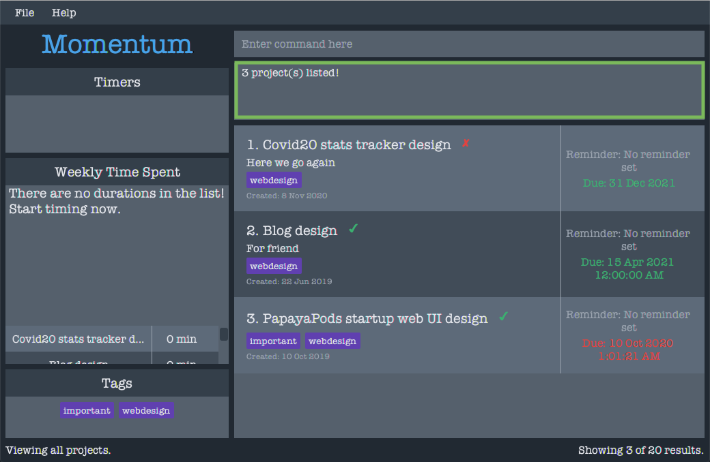
3. All projects that contain the tag `webdesign` will be shown.
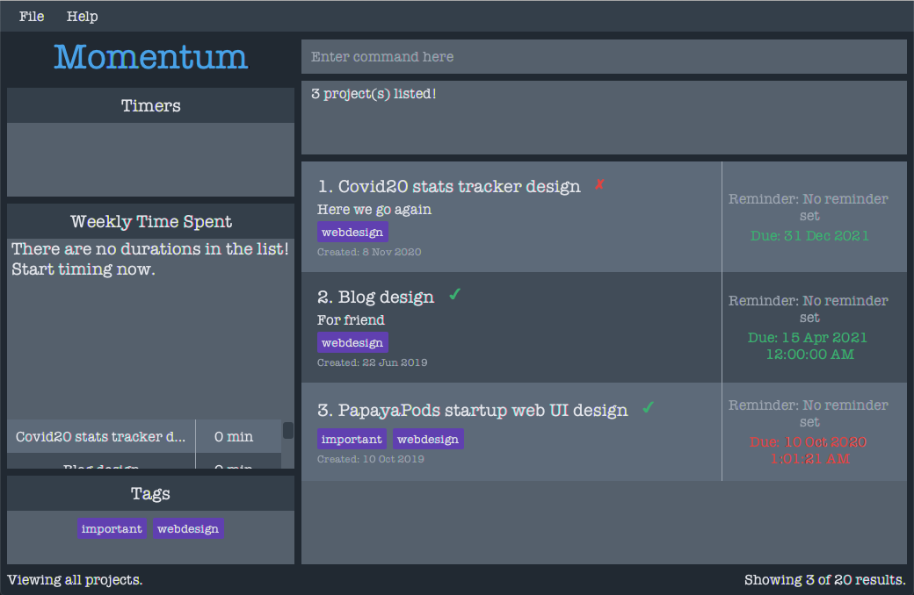

##### Searching by Completion Status

* There are keywords, completed and incomplete for`c/KEYWORD`. Other keywords are not accepted.
* The `c/` command checks whether a project is completed. For example, `c/completed` will check for the projects that are completed.
* When `c/` is not specified, both complete and incomplete projects will be shown.

The following walkthrough shows how you can use the find command to search for projects that have been completed.

1. Key in the command `find c/completed` in the command window.

2. The result box will display a message to indicate that the command has been executed successfully:
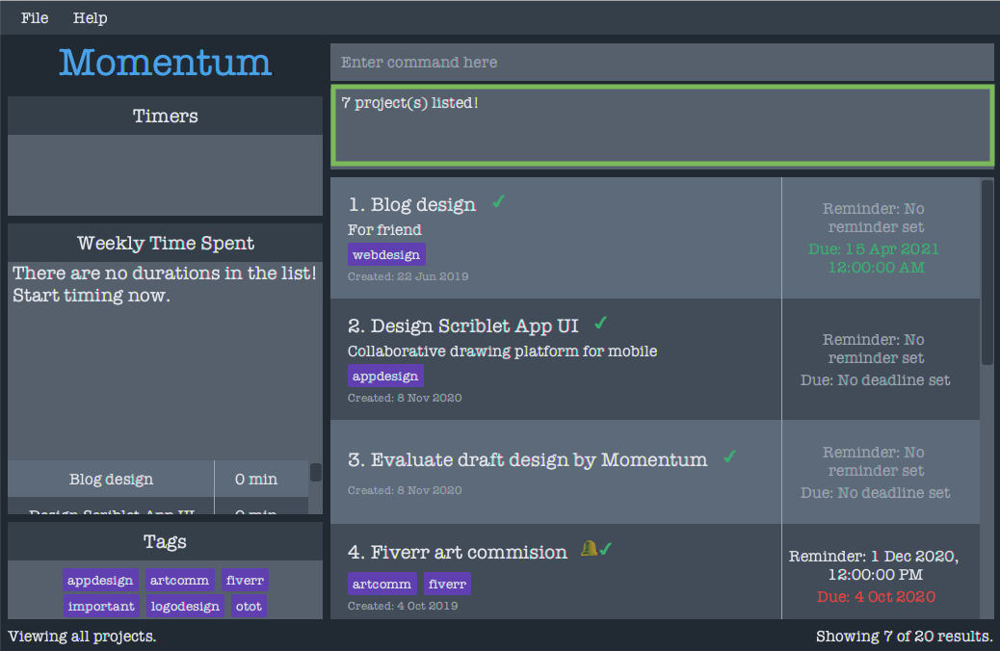
3. All projects that are completed will be shown.
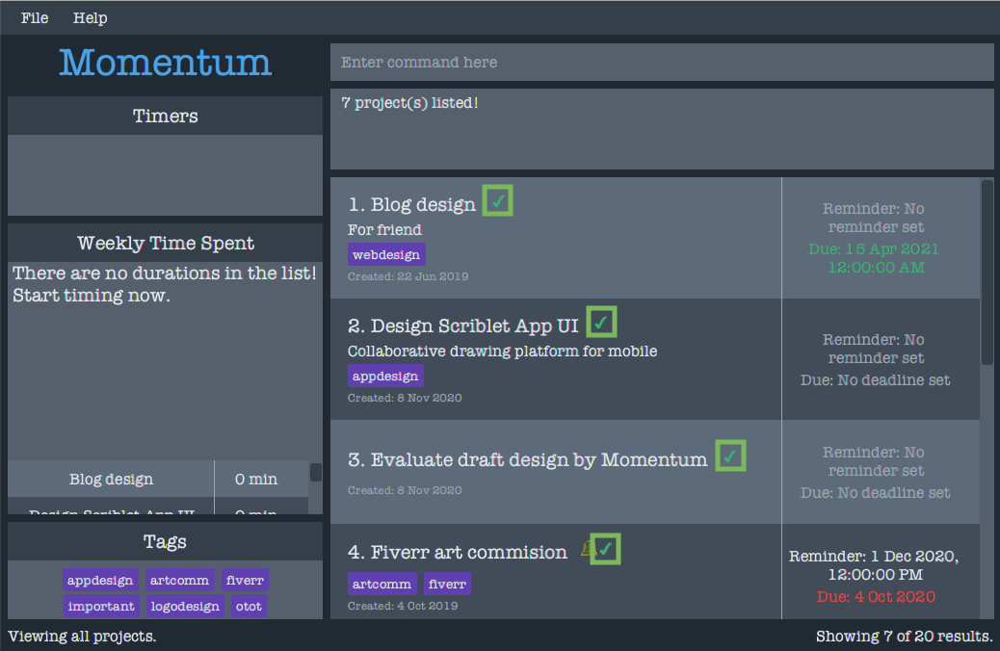

##### Searching by Multiple Keywords

You can search for projects or tasks with multiple keywords for names, descriptions and tags in a single search.

To do this, you can add all the keywords that you would like to search for in the command. For example, if you would like to
search for projects or tasks that contain either `discussion` or `drawing` in their descriptions, you can do so by searching using
the command `find d/discussion drawing`.

In this command, each keyword to search for is separated by a whitespace.

The following walkthrough shows you can use the find command to search for projects with `discussion` or `drawing` in their description.

1. Key in the command `find d/discussion drawing` in the command window.

2. The result box will display a message to indicate that the command has been executed successfully:
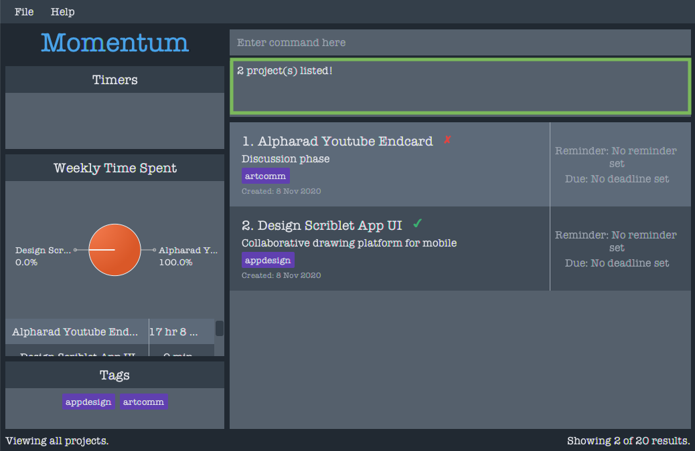
3. All projects that contain `discussion` or `drawing` in their description will be shown.
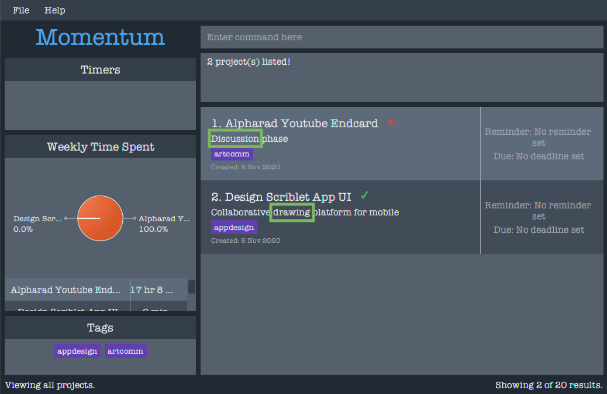

You can use the same method to search for projects using multiple keywords for name or tags. However, this will not work with completion status. You can only search by one completion status. 

##### Searching by Multiple Parameters

So far, you have learnt how to search for projects that contain multiple keywords for a single parameter. But what if you want to search for projects by multiple parameters instead? 

Momentum makes it extremely easy for you to do that. 

To make such a search, all you need to do is add all the parameters you would like to search for in a single find command. You can think of this as combining mulitple find commands together. For example, if you would like to search for projects or tasks that contain either `certification` in their name or `discussion` in their description, you can do so by searching using the command `find n/certification d/discussion`.

The following walkthrough shows you can use the find command to search for projects that contain either `certification` in their names or `discussion` in their description.

1. Key in the command `find n/certification d/discussion` in the command window.
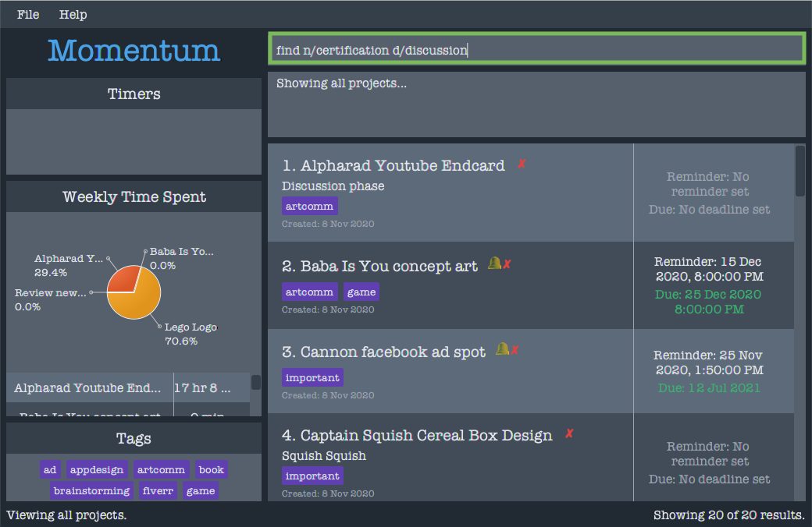
2. The result box will display a message to indicate that the command has been executed successfully:

3. All projects that contain `certification` in their name or `discussion` in their description will be shown.
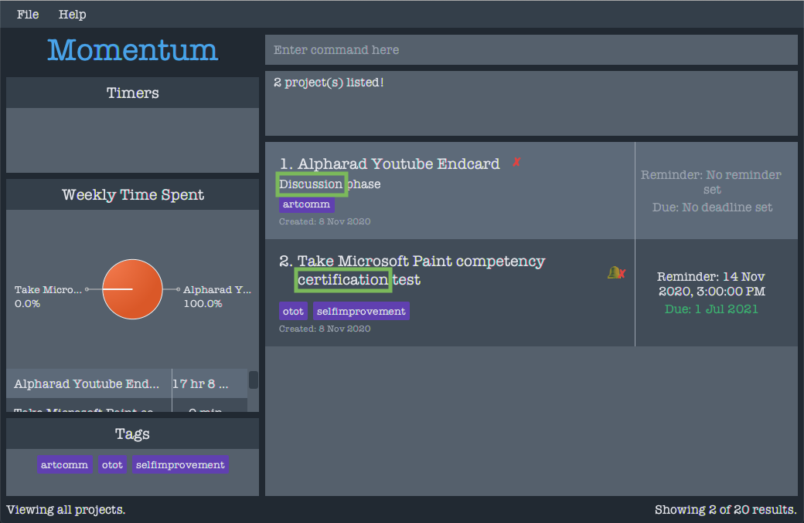

You can use the same method to search for projects by a combination of other parameters as well. You can also use multiple keywords for each parameter that allows for it as mentioned in the previous section. 

:bulb: **Tip:**
If a certain search type is used more than once, the latest entry will be used.
`find n/a n/b n/c` will only search for projects/tasks that contain`c` in their name.

##### Adding Match Type to Searches

So far, you have learnt how to make searches by multiple keywords and parameters. However, the searches shown so far show a project as long as there is any one keyword that matches it. But this might not be useful in some cases. What if you need to search for a project that matches all keywords, or does not match any of the keywords entered.

This is where match type comes in. Match type can be added to your find command in addition to the parameters you are searching by. 

There are three values for the `match` parameter.
  * `match/all` shows an entry only if **all** of the keywords and parameters provided in the user's input matches the entry.
  * `match/any` shows an entry as long as **any** of the keywords and parameters provided in the user's input matches the entry.
  * `match/none` shows an entry only if **none** of the keywords and parameters provided in the user's input matches the entry.

:bulb: **Tip:**
`match/any` will be used if the `match` type is not specified.

This might be a little confusing, so let's dive right into an example. We'll look at the example `find n/ad d/discussion t/artcomm` and compare how match type affects the results displayed.

Let's first look at `match/any`. This match type shows an entry as long as any keyword matches the user's input. It is also the default behaviour of the find command. The following walkthrough shows how to use `match/any`. 

1. Key in the command `find n/ad d/discussion t/artcomm match/any` in the command window.

2. The result box will display a message to indicate that the command has been executed successfully:
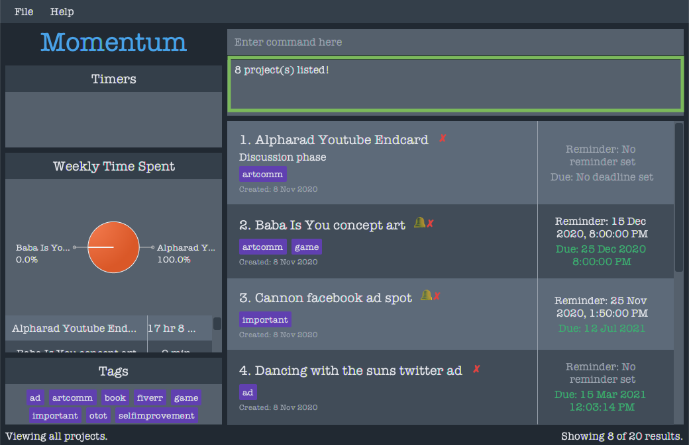
3. All projects that contain `ad` in their name or `discussion` in their description or the tag `artcomm` will be shown.
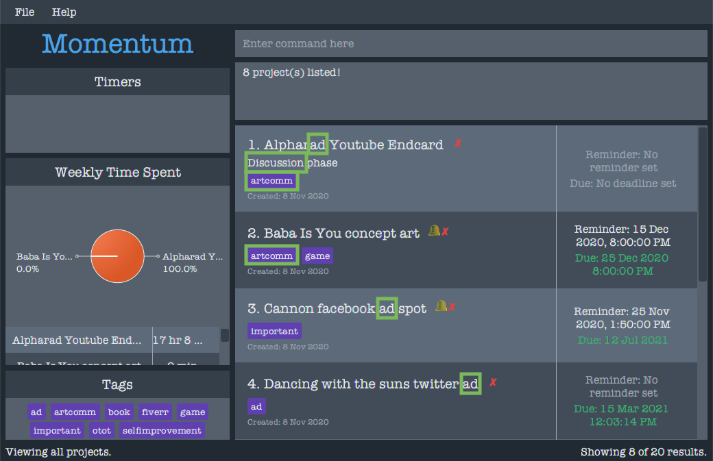

As seen in the example above, an entry is shown as long as any one of the keywords matches the project. 

Let's now look at `match/all`. This match type shows an entry only if all keywords matches the user's input. The following walkthrough shows how to use `match/all`. 

1. Key in the command `find n/ad d/discussion t/artcomm match/all` in the command window.

2. The result box will display a message to indicate that the command has been executed successfully:
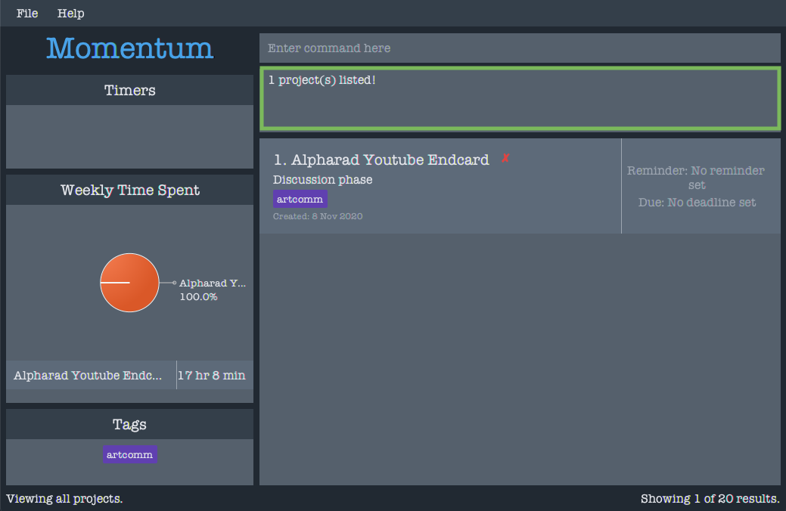
3. All projects that contain `ad` in their name and `discussion` in their description and the tag `artcomm` will be shown.
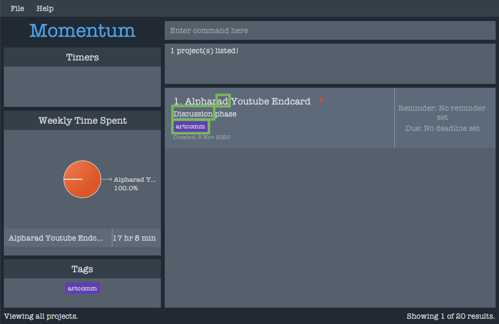

As seen in the example above, an entry is only shown if all keywords matches the project. 

Finally, let's look at `match/none`. This match type shows an entry only if none of the keywords matches the user's input. The following walkthrough shows how to use `match/none`. 

1. Key in the command `find n/ad d/discussion t/artcomm match/none` in the command window.

2. The result box will display a message to indicate that the command has been executed successfully:

3. All projects that do not contain `ad` in their name, `discussion` in their description and the tag `artcomm` will be shown.

As seen in the example above, an entry is only shown if none of the keywords matches the project. 

The posibilities of using match type to enhance your searches is limitless. Here are some examples where `match/all` and `match/none` may come in handy.

1. If you have many projects and want to find a specific project, you can use `match/all` to narrow down your search results.
2. If you have many projects and want to find projects that are not part of a certain category, you can use `match/none` to narrrow down your search results.

### Time Tracking

Done by Farrell Nah Jun Hao

You can track the time you spend working on a project or task by starting a timer when you start working, and then stopping the timer once you finish.

Momentum remembers each timer that you start/stop and uses this information to calculate statistics.

#### Starting a Timer for a Project: `start`

Format: `start ID`

* Starts a timer for the project or task at the specified `ID`.
* Only 1 timer can be running for each project or task at any time.
* You can refer to [`ID` Term](#id-term) for more information.

:bulb:
You can run timers for more than one project or task concurrently, if you are multi-tasking.

:bulb:
You can run timers for a project separately from its tasks. This allows you to track the time you spent on the project as a whole, as well as the time spent on each individual task.

Example: `start 2`

Result: Starts a timer for the second project or task in the display list.

#### Stopping a Timer for a Project: `stop`

Format: `stop ID`

* Stops a running timer for the project or task at the specified `ID`.
* A timer can only be stopped if there is one already running.
* You can refer to [`ID` Term](#id-term) for more information.

Example: `stop 2`

Result: Stops the timer for the second project or task in the display list.

#### Active Timers Panel

On the left side of the window is the Active Timers Panel. This is where Momentum shows you all the timers that are currently running.

Figure X: Location of the Active Timers Panel.

This panel will show you the name of the project/task, as well as when the timer was started.

#### Time Tracking Example

Here is an example of how you can use the `start` and `stop` commands to track the time that you spend on a project.
Suppose that you are going to start working on the project "Alpharad Youtube Endcard", which is the first item shown below:

You can perform time tracking with the following steps:

1. To start the timer, type `start 1` into the command box and press <kbd>Enter</kbd>.

    

2. You should see the following message in the result box, indicating that the timer has been successfully started.

    

3. You should also see the project's name and start time in the active timers panel:

    

   Now that the timer has been successfully started, you can proceed to do your work. You can also choose to close
 Momentum. The timer will continue to run even when Momentum is closed. Proceed to the next step when you are done
  with your work.

4. To stop the timer, type `stop 1` into the command box and press `Enter`.

    

5. You should see the following message in the result box, indicating that the timer has been successfully stopped.

    

6. You should also see that the project has been removed from the active timers panel:

    

8. The statistics panel (see [statistics](#statistics)) will also be updated to reflect the time that you have spent
 working on the
 project:

    

### Reminders

Done by Cheong Ying Yi Clara

* A reminder will be shown in the reminder panel of the sidebar at the date and time you specified.

* Momentum will remove the reminder in the project/task after it is shown in the sidebar.

* If you missed a reminder, it will be greyed out in the project/task.

* You can refer to [Walkthrough of Creating a Project](#walkthrough-of-creating-a-project) for more details on how you can add a reminder.

* You can refer to [Walkthrough of Dismissing a Reminder](#walkthrough-of-dismissing-a-reminder) for more details on how you can dismiss a reminder.

:warning: If you set multiple reminders at the same date and time, Momentum will only show one of the reminders in the reminder panel and mark other reminders as missed.

### Undo/Redo

Done By Kang Su Min

The undo/redo feature can be thought of as a "history traversal" function. After the execution of every command (excluding `help` and `exit`), all data at that point in time is stored in your Momentum history log.
The undo and redo command allows you to traverse up or down this history log such that you can recover any data that has been stored in your Momentum history at any point in time.  

#### Undoing the Previous Command: `undo`

The undo command undoes the last command that was executed. You can recover all data before the last command was executed.

Format: `undo`

Example: `start 1`, `undo`

Result: Timer for project/task at index 1 is started, then stopped and removed after `undo` is executed.

The following walkthrough shows how a user can start a timer for a project, then undo the command.

1. Key in command `start 1` in the command window then press <kbd>Enter</kbd>.

2. The result box will display a message to indicate that the command has been executed successfully, and the timer for that project will appear at the side panel.
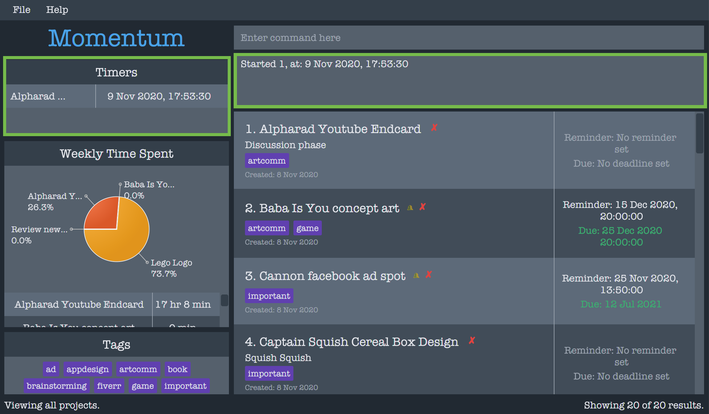
3. Key in command `undo` in the command window then press <kbd>Enter</kbd>.

4. The result box will display a message to indicate that the command has been undone successfully.

5. The timer has been removed from the project. Timer is no longer running.
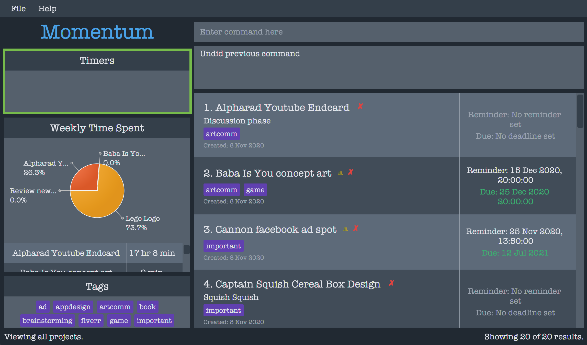

#### Redoing the Previous Command: `redo`

The redo command redoes the last command that was previously undone. You can recover all data before the last `undo` command was executed.

Format: `redo`

Example: `sort type/deadline`, `undo`, `redo`

Result: Projects are first sorted by deadline, then the application is reset to the sorting order before sort command was executed when `undo` command is executed, then reset back to sort by deadline after `redo` command.

The following walkthrough shows how a user can start a timer for a project, then undo the command.

1. Key in command `sort type/deadline` in the command window then press <kbd>Enter</kbd>.
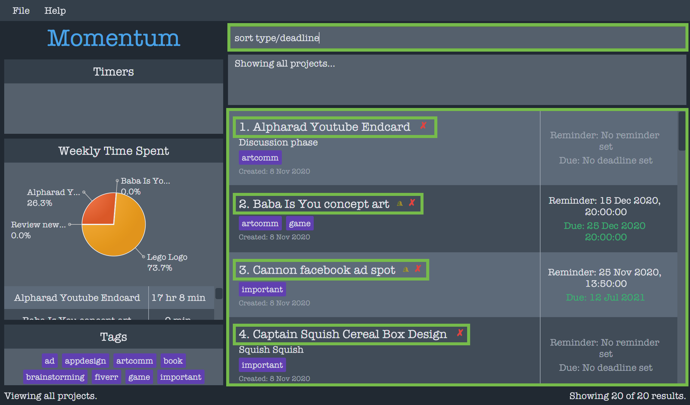
Note: The projects are currently sorted in alphabetical, ascending order (default order).
2. The result box will display a message to indicate that the command has been executed successfully. Projects are now sorted in ascending deadline order.
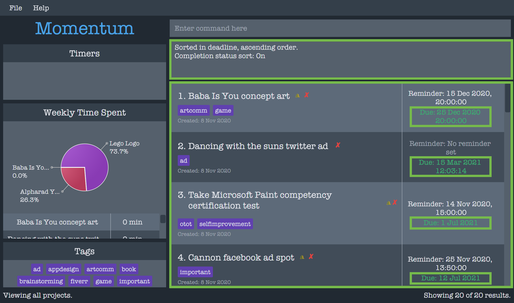
3. Key in command `undo` in the command window then press <kbd>Enter</kbd>.
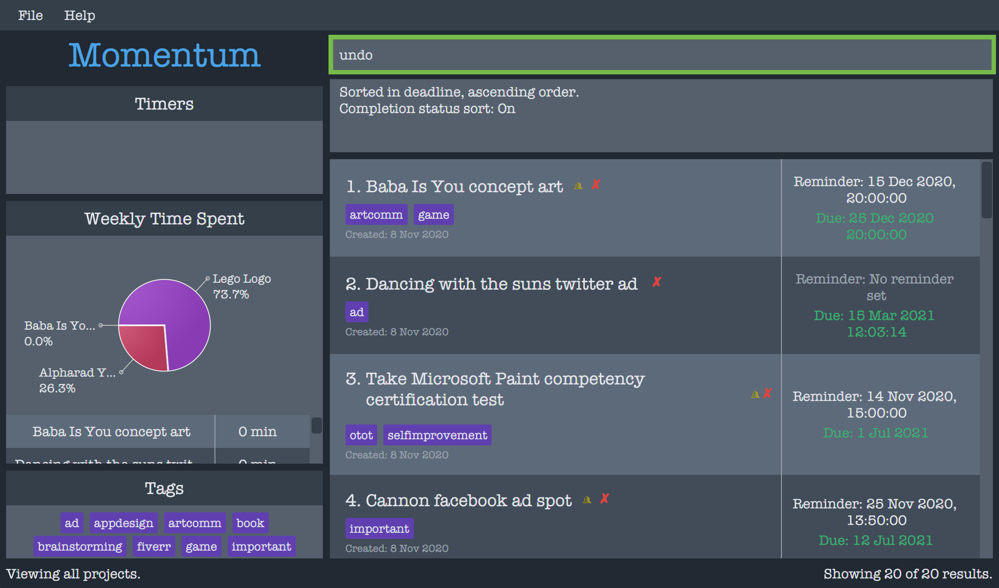
4. The result box will display a message to indicate that the command has been undone successfully. Projects are now sorted in their original order (alphabetical, ascending).
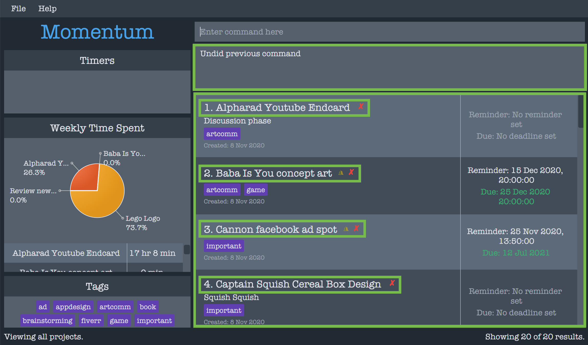
5. Key in command `redo` in the command window then press <kbd>Enter</kbd>.

6. The result box will display a message to indicate that the command has been redone successfully.
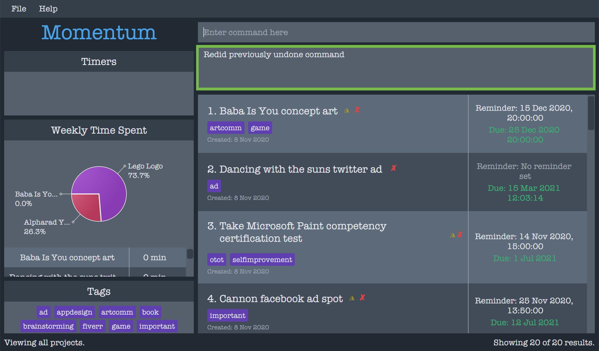
7. Projects are again sorted in ascending deadline order.
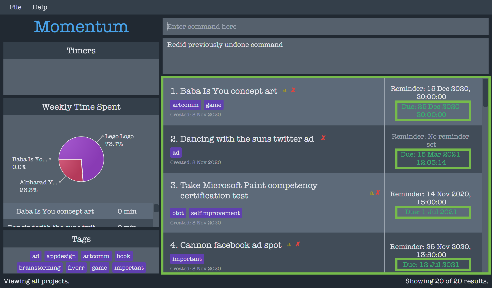

:bulb:
* Undo/redo feature keeps track of changes in data, and hence will not work on `help` or `exit` command which do not change the data in the application.
* Redo command only works if the previous command is `undo`.

### Statistics

Done by Farrell Nah Jun Hao

Momentum uses the data collected from your timers (see [time tracking](#time-tracking)) to calculate statistics. These
 statistics are automatically generated and updated whenever you make any changes to your projects and tasks, such as
  when you start or stop a new timer.
 These statistics can be seen in a panel on the left side of the window, as shown here:

Figure X: Location of the statistics panel

The statistics displayed correspond to the projects or tasks currently shown in the display list, and will automatically
 change when the items in the display list changes (such as when you find specific projects or sort the list of projects).

Figure X: The order of the statistics entries matches the order in the display list.

You do not need to use any additional commands to update or view the statistics.

#### Timeframes

Momentum only tracks your statistics within a particular timeframe. You can change the timeframe through the [settings](#settings).

Momentum allows you to track the time spent within these timeframes:

* Daily
* Weekly
* Monthly

By default, the timeframe will be set to weekly.

Here are the statistics being tracked by Momentum:

#### Time Spent Per Project

This statistic tells you the total amount of time you have spent within the timeframe. For projects, this includes
 all the time you have spent on each individual task, as well as on the project as a whole.

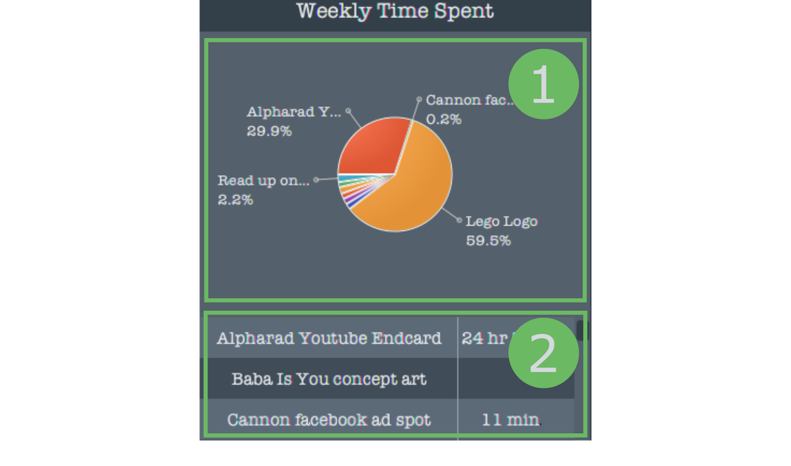
Figure X: Sections of the statistics panel.

The statistics are displayed in 2 different formats:

1. **Pie Chart**: Shows the relative time spent on each project. Useful for comparing different projects and tasks. Projects
 and tasks with less time spent on them may not be shown.
2. **Table**: Shows the exact (in minutes) amount of time spent on each project. Useful for calculations.

### Settings

Done by Khoo De Hui

Momentum allows you to change various settings so that you can make the application more suited to your preferences. Currently, the settings which you can adjust are:
* The application GUI [theme](#user-interface-theme)
* The [timeframe](#timeframes) of the statistics shown

Format: `set [th/THEME] [st/TIMEFRAME]`
* At least one of the optional fields must be provided.
* There are two GUI themes available, Light and Dark. The keywords to apply them are:
  * `th/light`
  * `th/dark`
* There are three available timeframes for statistics, daily, weekly and monthly. The keywords to apply them are:
  * `st/daily`
  * `st/weekly`
  * `st/monthly`

Example: `set th/light st/monthly`

Result: Sets a light theme to the GUI and changes the statistics pane to show the time spent on projects within the month.

#### Walkthrough of Changing Application Settings
1. In order to set your GUI theme to light and your statistic timeframe to daily, type `set th/light th/monthly` in the command box and press the <kbd>Enter</kbd> key to execute it.
 
2. The result box will display a message to indicate that your command has been executed successfully.
 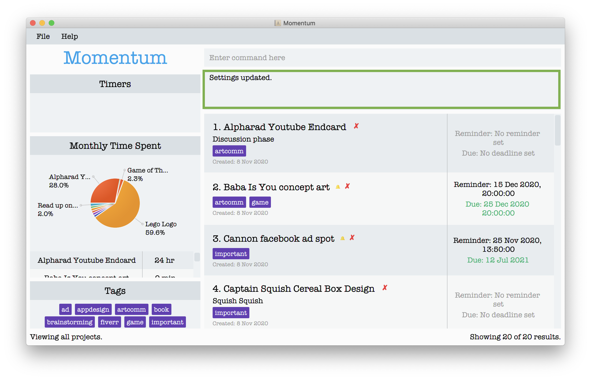
3. Your GUI has now been set to the light theme, and information in your statistics panel has been updated.
 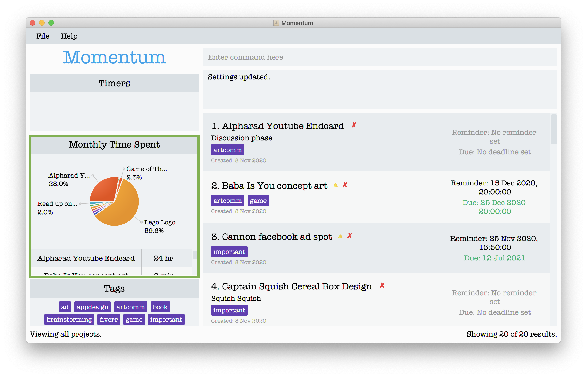

### Clear All Projects/Tasks : `clear`

Done by Farrell Nah Jun Hao

When you are viewing all projects, this command deletes all the projects in Momentum, including their tasks.

When you are viewing a specific project's tasks, this command will delete all the tasks in the project. The project
 itself will not be deleted.

:warning:
This command will also delete the saved data.
You can undo this operation while Momentum remains open.
However, you will not be able to undo this once you close Momentum.

Please be careful when using this command, as you may loose large amounts of your data.

Format: `clear`

#### Walkthrough of clearing Projects
Suppose that you would like to clear all the projects in Momentum.

1. Ensure that you are viewing all projects

    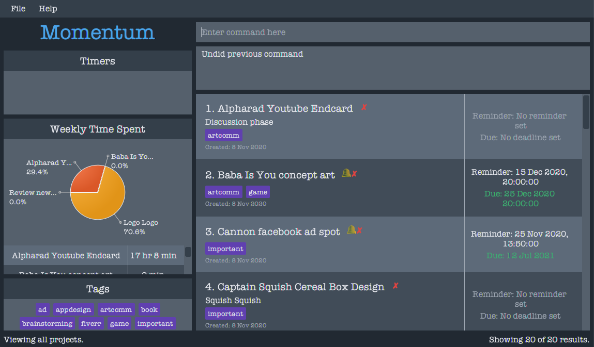
    
2. Type `clear` into the command box and press <kbd>Enter</kbd>
    
    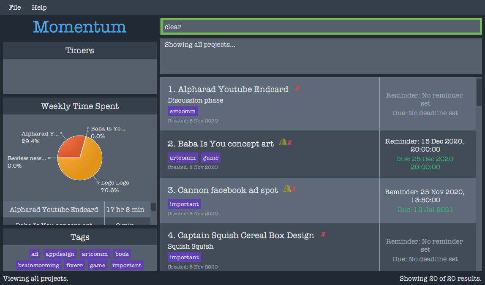

3. The result box will display a message to indicate that all projects have been cleared. You should no long see any projects in the display list.

    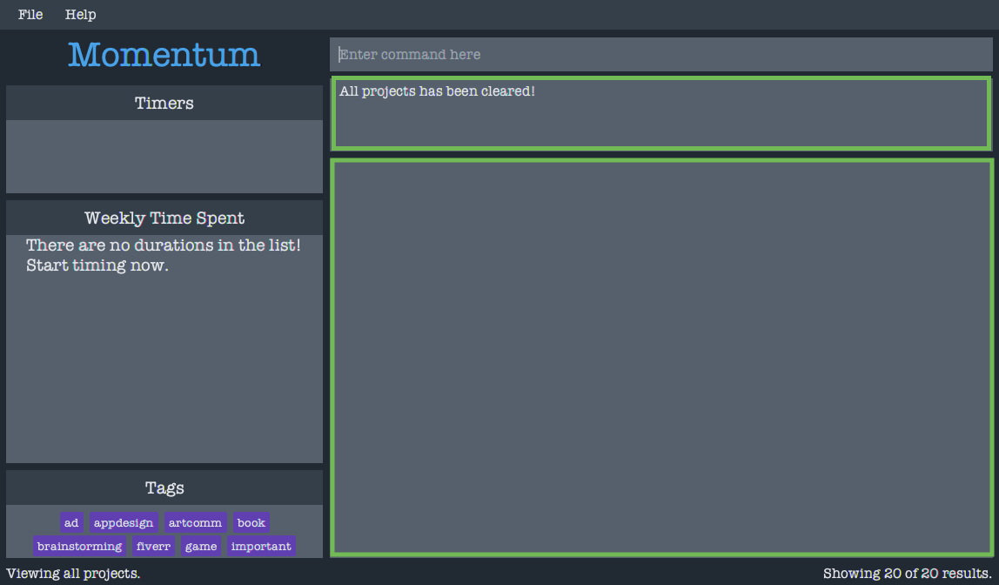

### Dismissing a Reminder : `dismiss`

Done by Cheong Ying Yi Clara

You can dismiss a reminder using this command.

Format: `dismiss`

Result: The reminder panel of the sidebar will be hidden.

:warning: You cannot dismiss a reminder if the reminder panel of the sidebar is not visible.

:warning: Momentum cannot show a reminder that you dismissed in the reminder panel again. You can undo a dismissal to show an expired reminder in the project/task.

#### Walkthrough of Dismissing a Reminder

This walkthrough is a followup of [Walkthrough of Creating a Project](#walkthrough-of-creating-a-project).

1. After the reminder panel is shown, you can type `dismiss` in the command box, and press the <kbd>Enter</kbd> key to execute it.
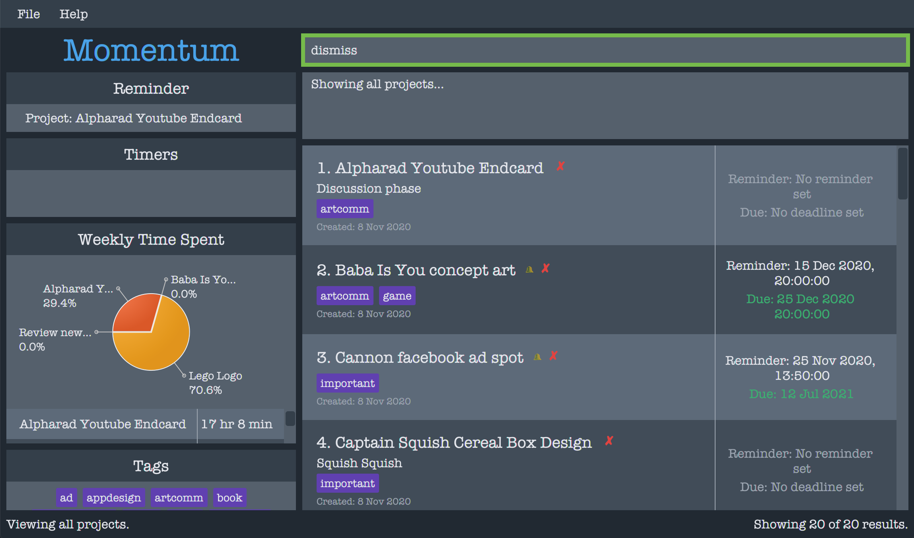

2. The result box will display a message to indicate that that you executed the command successfully.
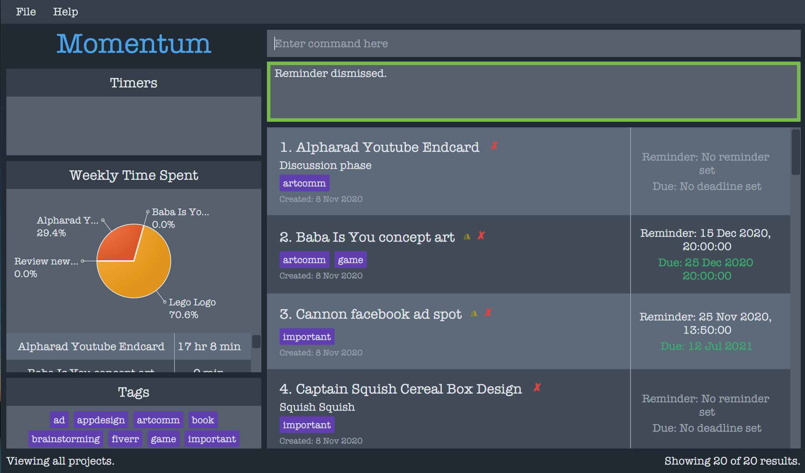

3. You dimissed the reminder as shown below.
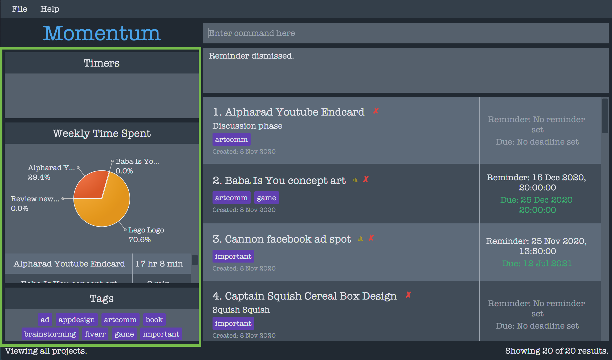

### Showing and Hiding Tags : `show`

Done by Cheong Ying Yi Clara

You can hide or show the tags panel of the sidebar.

Format: `show t/`

Result:

* If the tags panel was visible, the tags panel will be hidden.

* If the tags panel was hidden, the tags panel will be shown.

:bulb: You can resize the tags panel by clicking and dragging the edges.

#### Walkthrough of Hiding Tags

1. You can type `show t/` in the command box, and press the <kbd>Enter</kbd> key to execute it.
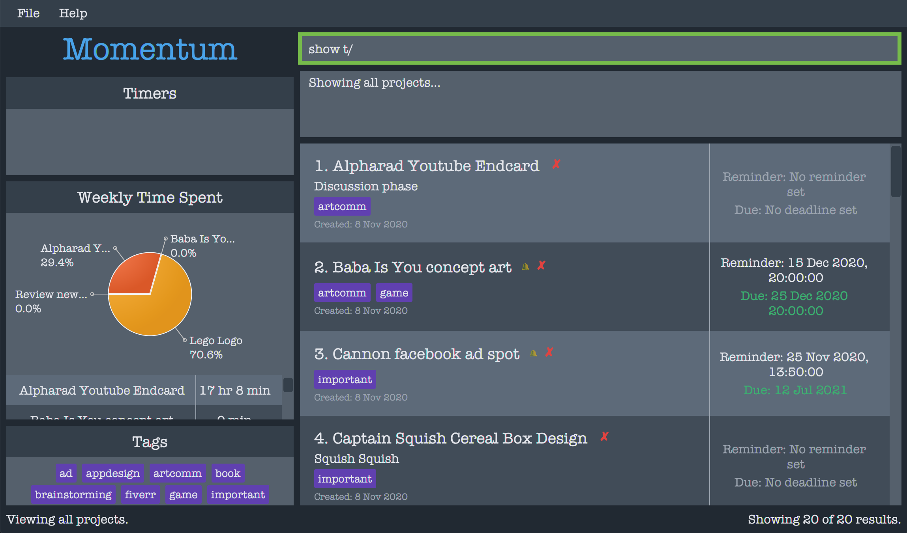

2. The result box will display a message to indicate that you executed the command successfully.
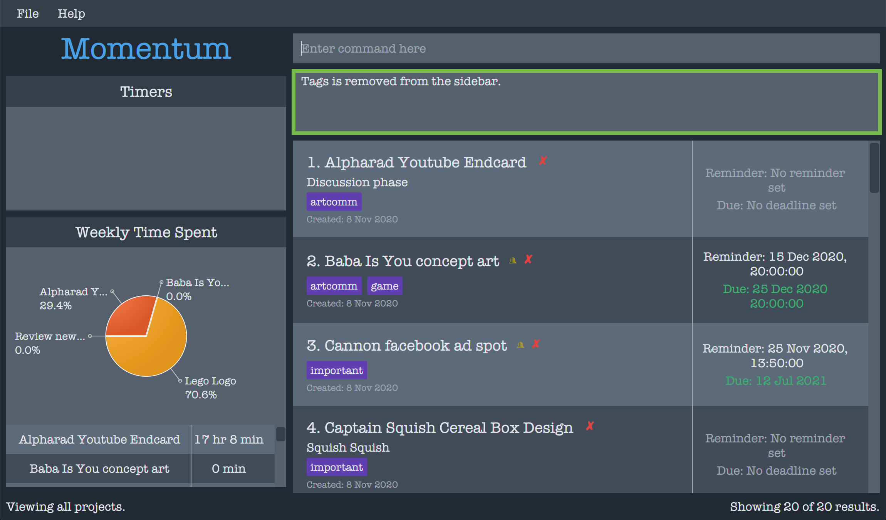

1. You hide the tags panel as shown below.
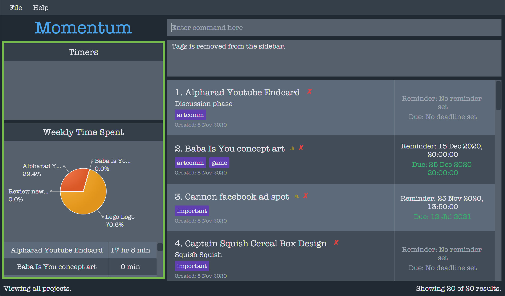

### Viewing Help : `help`

Shows a message explaning how to access the help page.

Format: `help`

### Exiting the Program : `exit`

All project, task and timer data are saved automatically after every command. There is no need to save manually.

You can find the saved data in the following file in the same location where Momentum is located: `data/projectbook.json`

Format: `exit`

Result: Exits the program.

--------------------------------------------------------------------------------------------------------------------

## FAQ

**Q**: How do I transfer my data to another Computer?  
**A**: Install the app in the other computer and overwrite the empty data file it creates with the file that contains the data of your previous Momentum home folder.

**Q**: Momentum is showing "Dates and Times should be in ISO8601 format. e.g. 2020-09-23T16:55:12". Whats wrong?  
**A**: You have entered a date and/or time in the wrong format. Please refer to the [date and time terms](#date-and-time-terms) for the correct format to use.

**Q**: Momentum showing "Unknown Command". Whats wrong?  
**A**: You have entered a command that is not recognised by Momentum. Please refer to [command summary](#command-summary) for a list of commands that you can enter into Momentum.

--------------------------------------------------------------------------------------------------------------------

## Glossary

* **Theme**: Colour scheme of the application
* **Command Line Interface(CLI)**: Command Line Interface processes commands in the form of text
* **Mainstream OS**: Windows, Linux, Unix, OS-X
* **Window**: The area of your computer's screen that displays the [user interface](#user-interface-overview) of Momentum
* **Project View**: View all projects in the project book.
* **Task View**: View all tasks that are added to a single project.

--------------------------------------------------------------------------------------------------------------------

## Command Summary

Action | Format | Example
--------|-------|-----------
**View tasks in a project**| `view ID` |`view 3`
**View all projects**| `home` | -
**Creating a Project/Task** | `add n/NAME [d/DESCRIPTION] [c/] [dd/DEADLINE_DATE [dt/DEADLINE_TIME]] [r/REMINDER_DATE_TIME] [t/TAG]​`|  `project n/Momentum d/CS2103T Team Project dd/2021-12-07 t/impt`
**Editing a Project/Task** | `edit ID [n/NAME] [d/DESCRIPTION] [c/]  [dd/DEADLINE_DATE [dt/DEADLINE_TIME]] [r/REMINDER_DATE_TIME] [t/TAG]`| `edit 3 n/NewMomentum d/NewDescription dd/2021-12-07 r/2021-12-07T01:21:21 t/normal`
**Delete a project/task** | `delete ID` | `delete 3`
**Clear all projects/tasks** | `clear` | -
**Find a project/task** | `find [match/FILTER_TYPE] [n/NAME [MORE_NAMES]...] [d/DESCRIPTION [MORE_DESCRIPTIONS]...] [t/TAG [MORE_TAGS]...]  [c/COMPLETION_STATUS]`  | `find match/any n/Momentum d/new t/normal`
**Show all projects/tasks (after find)** | `list` | -
**Sort projects/tasks** | `sort [type/SORT_TYPE] [order/SORT_ORDER] [c/]` | `sort type/deadline order/dsc c/`
**Start Timer** | `start ID` | `start 2`
**Stop Timer** | `stop ID` | `stop 2`
**Dismissing a Reminder** | `dismiss` | -
**Showing and Hiding Tags** | `show t/` | -
**Undo** | `undo` | -
**Redo** | `redo` | -
**Help** | `help` | -
**Settings** | `set [th/THEME] [st/TIMEFRAME]` | `set th/dark st/daily`
**Exit** | `exit` | -
